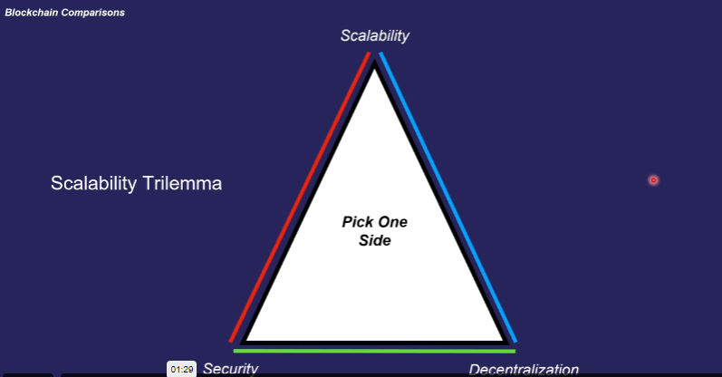

# Ethereum and Smart Contracts

## Introduction to Cryptocurrency

- Any currency in digital or virtual form using crpyograpgy for security.
- Decentralized.
- Whitepaper : A document that expains the technology and purpose behind a cryptocurrency.
- ICO : Initial coin offering. This is just like IPO.
- Fiat Currency: A traditional government issued currency which exists physically. A fiat currency is not tied to gold. Government control their circulation.
- Fiat currency is backed only by the faith of the government.

## Bitcoin Facts

- Bitcoin can only be used for decentralized finance.
- Bitcoin is the first cryptocurrency. It is referred as digital gold.
- Bitcoin is Turing incomplete - You can only do limited stuff on it.

## What is Turing Completeness ? 
- All modern programming languages like C, C++, JS are turing complete.
- For a language to be turing complete it should be able to do anything that a Turing machine can do.
- A Turing machine is an endlessly long piece of tape that has a read/write head. It can read/write 0's and 1's in the cell on the tap. This allows anything to be computed.
- Turing Machine requirementss
    - Must be able to perform conditional branching - must have if else block.
    - Can express any possible program - loops, infinite loops, while loop.
    - You cannot predict or prove the final state of a Turing complete language.

## Introduction to Ethereum

- Turing Complete
- Does not only provide decentralized finance. It is considered a decentralized development platform.
- Allows development and usage of decentralized apps with the use of the native ether token.
- Has a programming language called Solidity that allows you to write code(smart contracts) that are hosted on the blockchain.
- Smart contract allows programs to be decentralized.
- Now you can decentralize games, autctions, currency and much more using smart contracts.

## Smart Contracts
- programs that are stored on the blockchain and get executed when some predetermined condition is met.
- Used to automate the execution of an agreement.
- Properties of smart contracts 
    - Immutable
    - Transparent or public
    - Executed by nodes on network
    - cost money to deploy
    - Can hold a balance, just like regular address.
- Can only run when provided a gas.
- you cannot have an infinite loop running in a smart contract.
- All operations are traceable and immutable
- Cannot make HTTP requests or reply on any data outside of the blockchain.
- DApps are made up of one or more smart contracts.
- Smart contract is stored inside the block of a blockchain.
- You have to pay a fee then only the block would be picked up by validators to be added to the blockchain.

## DApps Examples
- Auctions
- Games
- Sale of Assets
- Decentralized Exchanges(Uniswap, pancakeSwap)
- Web Browsers (brave)
- Credit Services (MakerDAO)
- DAOs (Decentralized Autonomous Organizations) - Governance systems which are decentralized.

## Why use a decentralized application ? 
- If I know it a gambling machine, a decentralized machine would be better because I know that no one can mess with the machine and decrease my odds of winning. I can look at the code and check whether the machine is fair or not.
- No need of real estate agents.
- No need of lawyers.

## ERC 20 Tokens

- **Coin** : A coin is a currency that represents a blockchain as a whole. eg ETH
- **Token** : A token is something which exists within that network. eg Tether
- **ERC Tokens** : Fungible tokens on ethereum network which follow ERC 20 protocol
- **Fungible Tokens** : Tokens whose number matters rather than the exact token. They can be interchanged. eg. I take a 10 rupee note from you and give another 10 rupee note. The denomination matters here, not the serial number of the note.
- **Non Fungible Tokens** : unique tokens, tokens which cannot be exchanged. eg NFTs.
- ERC 20 token can be created by anyone using a smart contract which follows the protocol.

## ERC 20 Token use cases
- **Crowdfunding** : Instead of going through the traditional funding route, some startups create ERC 20 tokens where you buy the tokens to invest in startups. If you own some tokens, it means you are owning a part of the company.
- **Voting Rights** : Someone can distribute tokens to the public and only those people can vote who have that token. 
- **Representations of ownership** : token represents some part of gold, car, property etc.
- **Paying for features/DApps**
- **Stable Coins** : Hold the token which is pegged to something. Even thought ETH can go up and down, stable coins remain stable.
- **Enterprise software**
- **Royalties** : Based on the percentage of ownership, the royalties are distributed in the form of tokens based on the smart contract.

>A token is essentially a transaction which states that "xxxxxx address hold 3 tokens".

## ERC 721 Tokens
- Non-fungible tokens on Ethereum network that follow ERC 721 protocol.
- ERC 721 Token can be created by anyone by deploying a smart contract obeying the protocol.
- Each ERC 721 token has a unique id.
- The token is connected with some metadata such as images, videos, sound, attributes etc.
- The image mapped to this token can be changed also because typically that is not stored on the blockchain like a database.
- They are useful to prove ownership of unique items.

> you can use [etherscan.com](https://www.etherscan.com) to view the smart contracts

## Blockchain Comparison

- **Layer 1** : Refers to a base network like Bitcoin or Ethereum and its underlying infrastructure.
    - It is very difficult to improve the scalibility.
    - Can validate and finalize transactions without the need for another network.
    - Eg. Solana, Bitcoin, Cardano, Ethereum.
- **Layer 2** : Wrapper on top of Layer 1.
    - Performs transformation off the main chain and reports it back to the main chain for validation.
    - Have additional features like side chains etc.
    - Can provide faster transaction processing time and low gas.
    - Often lack decentralization due to limited adoption and usage.
    - Eg Arbitrum, Optimism, Bitcoin lightning.
    - Some of these use roll ups where you can bundle a bunch of transactions and submit them as one transaction on the main chain to save gas.

## Stable coins
- relatively non-volatile crpytocurrency asset.
- useful as a medium of exchange due to volatility of most crpytocurrencies.
- can be thought as digital cash.
- Maybe pegged to a currency like USD, gold etc.
- Pursue price stability by maintaining reserve assets as collateral or through algorithmic formulas that are supposed to control supply.
- Stable coin properties
    - Relative stability
    - Stability method
    - Reserve assets
- Core Use cases
    - storage of value.
    - medium of exchange.
    - unit account - can be used to measure the current value of different assets. For eg, when you go to a grocery store everything is in USD.
- Stability method
    - Governed
        - Requires human intervention to control the price
        - considered centralized
        - requires a central entity to inject collateral into the system
        - eg thether
    - Algorithmic
        - smart contracts facilitates burning or minting of coins.
        - requires no human intervention
        - Eg. Dai

- Reserve Assets
    - Exogenous
        - Collateral exists outside of the protocol.
        - Tether uses USD as collateral.
        - Dai uses multiple cryptocurrencies as collateral.
    - Endogenous
        - Collateral exists inside the protocol.
        - Terra uses LUNA
        - Using endogenous collateral is dangerous when people lose faith in collateral and stable coin at the same time.

## Oracles

- Allows connecting blockchain to off chain data.
- Smart contracts cannot access the third party data easily.
- Oracles send the off chain data to the blockchain through a transaction so that it can be validated.
- **Chainlinks** : Layer 2 solution on Ethereum which allows you to connect your blockchain to data sources. Chainlink is a oracle network.
- There are some trusted nodes that chainlink talks to, to get the data. When you ask for off chain data from the blockchain network, chainlink talks to one of these trusted nodes to get you that data. 
- These nodes then submit the data in the form of a transaction to the blockchain and after validation this data is made available.
- **Usecase : Generating a random number**
    - In games, we often need a random number generated fairly.
    - random numbers need a seed.
    - Everything on blockchain is publicly available.
    - If a player sees the seed, then he can pass the same seed throught the function and get the random number.
    - So what we can do is generate this seed off the chain and pass it to the blockchain using Oracles.
    - Smart contracts cannot make api calls. They can only generate events.
    - The off chain node listening to the events sees that the event is generated and then sends the random number to the blockchain.
    - One problem is the player can control the off chain node because it is not in the blockchain and pass a random number which he knows.
    - This is where chainlink comes into picture where chainlink randomly selects a trusted node to generate the random number.
    

