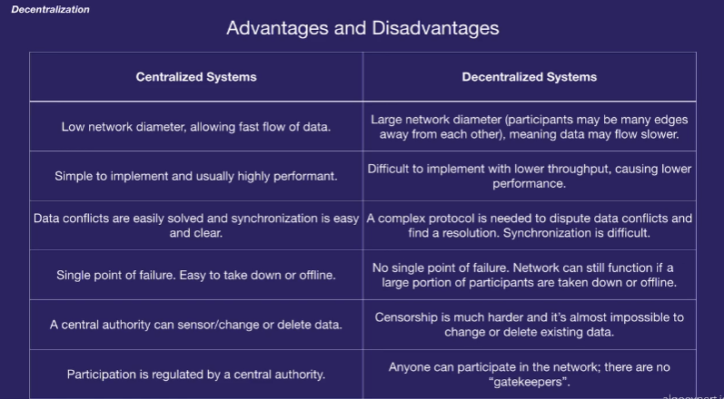

# Blockchain Expert

# Fundamentals of Blockchain

## Advantages of Blockchain?

- Blockchain helps you create decentralized systems. 
- In a centralized system, you trust the owner of the software to not miss use your information. The owner can be Amazon, Google or the government.
- Decentralized system aims at eliminating this dependency. In such a sytem, no one can control the system and the trust is ensured by software.

## Web 1.0 vs Web 2.0 vs Web 3.0

### Web 1.0
- Mostly readonly content.
- No focus on UI/UX. It's literally like someone has just dumped a book online.

### Web 2.0
- Focuses on user generated content.
- Large focus on UI / UX.
- Uses AJAX and javascript for dynamic websites.
- User data is owned and controlled by companies.

### Web 3.0
- Focuses on how is data stored and controlled.
- Data is not controlled by a party but owned by the network as a whole.
- Immersion over interaction.

## Centralized vs Non centralized Systems
- Most systems we use today are centralized.
- We use centralized system because we trust that system.

## Advantages and Disadvantages

## Ledgers

- Suppose Alice sends Bob $1.
- Who will ensure the trust in this transaction?
- Alice and Bob can do it through a bank and now both Alice and Bob would trust the bank for the authenticity of this transaction
- This trusted transaction is called a ledger. 
- In a decentralized system, this ledger is with different machines. So you trust the network not a single entity.

