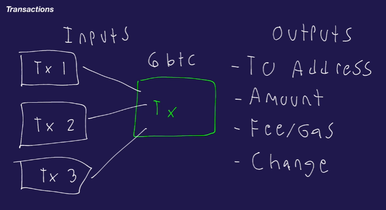

# Blockchain Expert

# Fundamentals of Blockchain

## Advantages of Blockchain?

- Blockchain helps you create decentralized systems. 
- In a centralized system, you trust the owner of the software to not miss use your information. The owner can be Amazon, Google or the government.
- Decentralized system aims at eliminating this dependency. In such a sytem, no one can control the system and the trust is ensured by software.

## Web 1.0 vs Web 2.0 vs Web 3.0

### Web 1.0
- Mostly readonly content.
- No focus on UI/UX. It's literally like someone has just dumped a book online.

### Web 2.0
- Focuses on user generated content.
- Large focus on UI / UX.
- Uses AJAX and javascript for dynamic websites.
- User data is owned and controlled by companies.

### Web 3.0
- Focuses on how is data stored and controlled.
- Data is not controlled by a party but owned by the network as a whole.
- Immersion over interaction.

## Centralized vs Non centralized Systems
- Most systems we use today are centralized.
- We use centralized system because we trust that system.

## Advantages and Disadvantages

## Ledgers

- Suppose Alice sends Bob $1.
- Who will ensure the trust in this transaction?
- Alice and Bob can do it through a bank and now both Alice and Bob would trust the bank for the authenticity of this transaction
- This trusted transaction is called a ledger. 
- In a decentralized system, this ledger is with different machines. So you trust the network not a single entity.

## Wallets

- Wallets hold your cryptocurrency. These essentially contain the following things
    - Private Key - You cannot lose your private key at any cost. Cannot be recovered.
    - Public Key - Needed so that people can send you funds. Public key is generated using the private key and a hash function.
    - Address - Public key is passed through hash function to generate address. We do this so that we can generate a readable address which we can easily use. Address is shorter than the public key hence it is easy to deal with. It also adds an extra layer of security.
- Private Keys are not stored in plain text. They are stored in encrpyted format. You would have a password which you would use to encrpyt the private key using an encryption algorithm, and it will spit out some random string which means nothing to anyone.
- You can have multiple address to give to different people. This helps you to organize your funds.

## Hash Functions

- A hash function is a function whose inverse doesn't exist.
- Hash functions are used to generate the public key from the private key,
- y = f(x) ; x is the private key, y is the public key.
- The security of the internet is based on the properties of hash function.
- you can still use brute force to guess the private key from the public key and hash function. This is very difficult to do.
- Hash functions are very fast to compute.
- They generate outputs which are uniform. eg. having the same length.
- Hash functions are deterministic i.e. same output for same input. This property is used to prove the owner of a wallet. The private key is passed throught the hash function. If the same public key is generated then that person is the owner of the wallet.
- Hash functions cannot have hash collisions practically.
- The output of a hash function is called digest.

## Seed Phrases

- Seed phrases help you regenerate your private key in case you lose it.
- All the wallets provide you seed phrases to do private key recovery.

## Transactions

- Transactions allow you to exchange funds over the network
- A transaction consist of the following:
    - From: sender
    - To: recipient
    - Amount: amount of funds
    - Gas/Fee: Amount you need to pay to the miners to add your transaction to the blockchain
    - signature: the digital signature which proves the authenticity 
    - Tx Hash: transaction hash unique to every transaciton
    - nonce: number of transactions from that account. When you make your first transaction nonce: 1 then 2,3,4...
    - date: auto-populated
- Transaction pool: Where the transactions go before being officially added to the blockchain. Miners pick up transactions from the transaction pool and then add them to the blockchain.
- Inputs to the transaction
- Outputs to the transaction
    - To : address of recipient
    - Amount: amount to be sent
    - Fee/Gas: More gas, more priority to your transaction to be picked up by miners. There is a min. gas fee.
- To pay the amount of the transaction, you need to feed more transactions to your transaction which sum upto atleast the amount + gas fee. This would prove that you have let's say 6 bitcoins which you are paying to someone else.

- If your transactions > amount + gas, the remaining amount is sent back as change to your wallet.
- This keeps an entire history of transactions or log on the blockchain.
- **Transaction hash** - The message (data for transaction) is passed through a hash function to generate the transaction hash. A transaction hash is tightly associated with the original message. Any change in message would make this transaction hash invalid.
- **Signing key**: this is your private key used to sign the transaction hash
- **Verification key**: this is the public key used to decrypt the signature and verify the transaction hash.
- **Verification process** - Miners verify your transaction using the following process
    1. They use your public key to decrpyt the signature and get the original transaction hash
    2. They then use the hash function to generate the transaction hash on their own.
    3. If both the hashes are equal, it means the signature is valid.
    4. the transaction is then added to the blockchain.

## Blocks

- Block data contains the following 
    - Magic number : A constant value to identify the block
    - Block size: The amount of data which a block can hold
    - Block header: Contains metadata
    - Transaction count: Number of transactions stored on the block
    - Transaction data: actual transaction data
    - Version: version of blockchain network
    - previous block hash : hash of previous block. Helps to connect the chain.
    - hash merkle root: merkle tree is used to check if a transaction is part of a block or not. Used for validation
    - timestamp
    - bits/difficulty: More bits, more difficulty to mine the block
    - nonce: Proves that a certain block is valid and some work has been done to prove it.
    - block reward: how much bitcoin to pay the miners

> The first block in the bitcoin network is called the genesis block

- Genesis block defines the difficulty and difficulty interval
- mining rewards and reward changes
- circulating supply eg 21 million bitcoins

## Blockchain Security

- Blockchain should prevent someone from deleting a transaction from a block
- Blockcain should prevent somene from doing the same transaction twice with the same inputs. Since transactions in a bitcoin blockchain are submitted randomly, if someone submits two transactions with the same input, one of them would be rejected(when it will see that a transaction with similar input is already present in the blockchain).
- exploited code : code vulnerabilities could also cause a problem to the blockchain.
- **51% attack** : If the blockchain network is small, a single individual can get access to 51% resources and get consensus. He can then vote a wrong transaction to be accepted.

     

 

