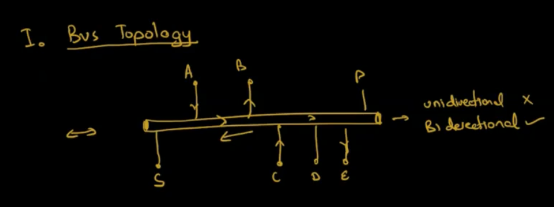
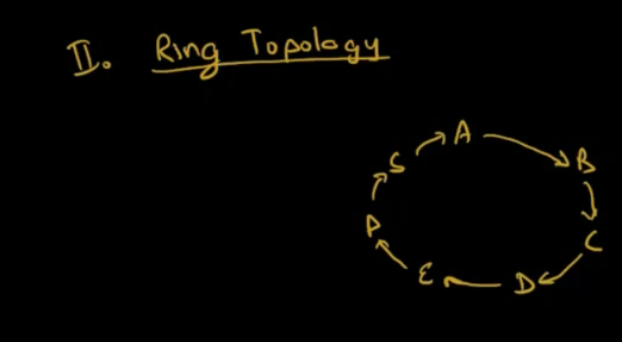
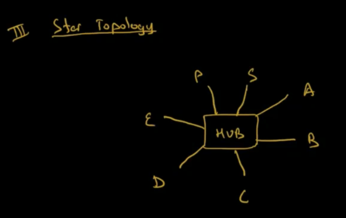
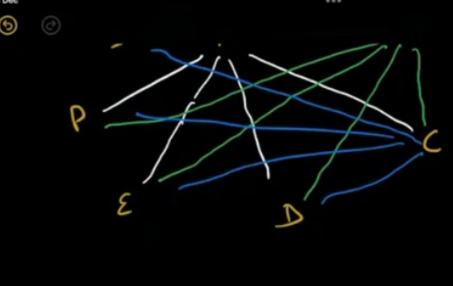
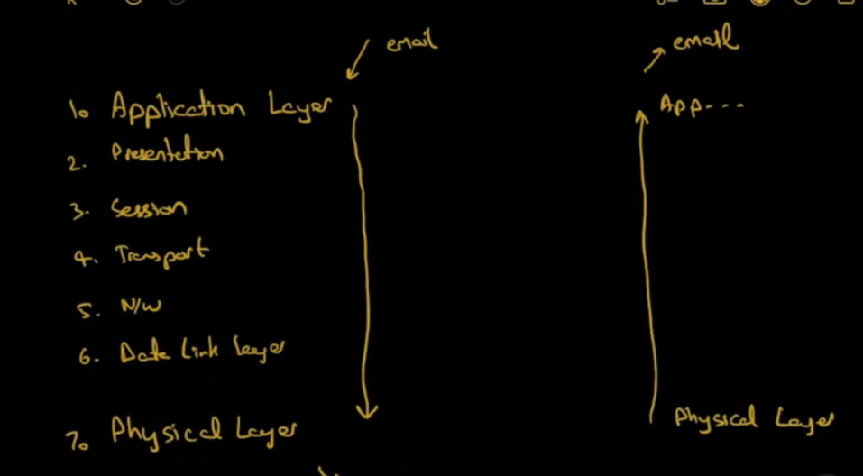
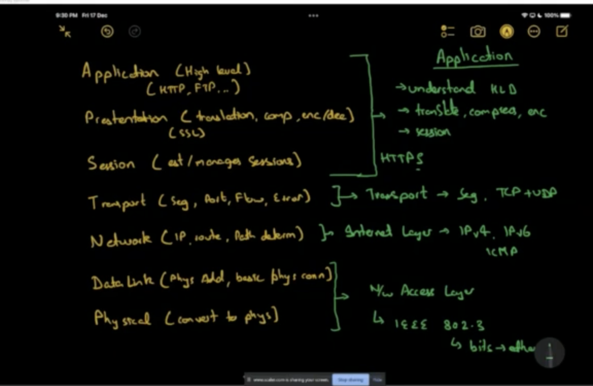
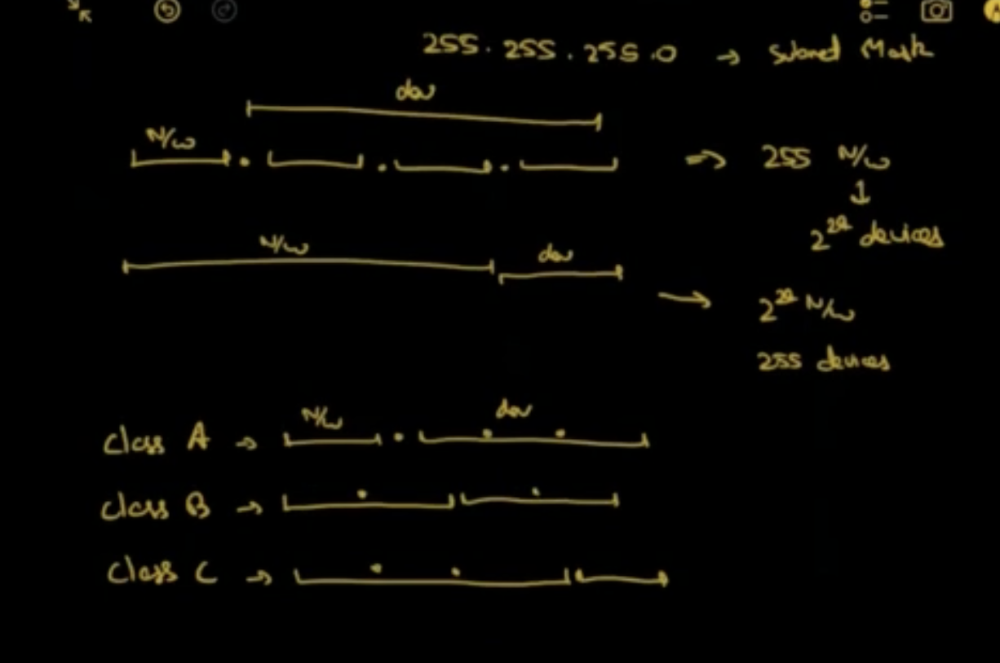
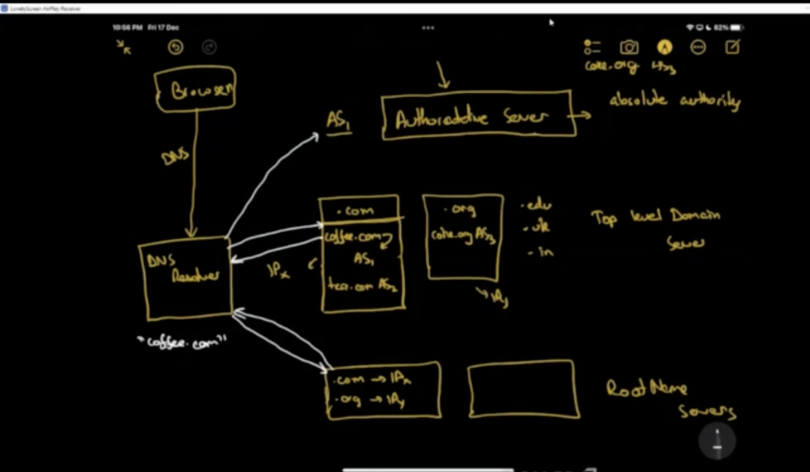

# Computer Networks

## Resources 
- Forouzhan
- Taenunbaum

## Topologies

### Bus Topology

- Easy to extend
- Single point of failure
- Insecure
- Resistant to node failures
- Simplicity
- Bandwidth limitations

### Ring Topology

-  Unidirectional would work here because you can transfer data to all nodes.
- Directional usually means you have two cables running in different directions.
- Node failure can cause single point of failure.
- Cable failure can bring down the network.
- Adding or removing nodes is tough

### Star Topology
- Single point of failure
- easy to extend
- secure
- expensive
- fast

### Mesh Topology

- A lot of cables are needed
- easy to troubleshoot because you know which cable failed
- No single point of failure
- Security
- nC2 cables needed
- Fast
- Very reliable
- Impractical

## OSI Model

-  set of Guideline to convert data from application layer to physical layer and vice versa.
- Application layer is first layer, physical layer is seventh layer.
- OSI models defines 5 layers in between

- How to remember this ? "Andra Pradesh se Tamil Nadu Data Pahucha"
    - Application layer
    - presentation layer
    - session layer
    - transport layer
    - network layer
    - data link layer
    - physical layer

### Application Layer
- Let's you work on the application level without going into intricate details.
- Applications can be Gmail etc.
- Some protocols : FTP, POP3, SMTP. These define how your data is going to be transfered to the lower layers.
- HTTP / HTTPs
- This is the layer user interacts with.

### Presentation Layer
- ASCII 
- Takes your text and converts into binary data
- After presentation, you will lose the meaning of data because it will be binary.
- You can do compression at this layer because you know the meaning of data.
- lossy compression vs lossless compression
- Encryption / Decryption - SSL layer
- after this layer, you will have encrypted and compressed binary data.

### Session Layer
- Establish, maintain and close sessions and connections
- It keeps sessions for different browsers separate
- Cookies are one way to manage sessions
- Authentication and Authorization happens at this layer
- Authentication : Is the user who he claims to be ? 
- Athorization : Does this user have necessary permissions ?
- Authentication is done by login id and password.
- After this layer, a session is assigned to you.

### Transport Layer
- Segmentation : At one go, you cannot transfer a lot of data. So this layer breaks the data into small segments
- The segments need sequence numbers so that the recipient will know the order to combine the data.
- You add ports to the segments so that they know which application to go to.
- Flow control : if the server transfers at 100mbps but phone can only support 10mbps, they both sync and decide to transfer data at 10mbps
- End to end error check throught checksums
-  TCP, UDP.
- after this layer, you have segments with ports and checksums

### Network Layer

- Network layer figures out the ip address of the receiver and sender and adds it to the segment
- Knowing the ip address is called logical addressing.
- Router can do path determination. So when a segment comes with an ip address, it knows which direction it needs to go.
- After this layer, your segments contain ip address.

### Data Link Layer
- Physical Addressing, it finds the MAC address of where your packet needs to go.
- Adds the mac address to the segments. It also adds a tail for frame level checksum
- When you add mac address to a segment, it is called a frame.
- After this layer, you segments have mac address in them and are called frames now.

### Physical Layer

- Converts the data into electrical signals to be transmitted through cables and routers.

## TCP/IP Model

- Network layer has been renamed to Internet layer and supports both IPv4 and IPv6
- Data Link layer and Physical layer has been combined into network access layer. It defines standard called IEEE 802.3 to convert bits to ethernet signals

## HTTP

- http is the way of communication which your browser is using to communicate with the given domain name.
- HTTP is request-response or client-server protocol. You will only receive data when a request is made.

> You cannot use HTTP to design whatsapp because you would need to request regularly to get latest messages, which is not realtime. XMPP is used in Whatsapp.

- GET, POST : Methods to tell what to do via. HTTP.
- Browsers by default do GET calls.
- To do POST calls through browser, you need to submit forms.
- **content-type and auth tokens** : content type tells the format of the data. This was done in the presentation layer in OSI model. HTTP is a very powerful layer in TCP/IP because it combines functionality of various layers in OSI model in one place.
- HTTPS : SSL certificate. Some authority has authorized that netflix is using SSL hence it is allowed to use HTTPS protocol. It is secure.

## DNS lookup 

- DNS lookup is the process which resolves the Domain name to an IP address.

## Transport Layer in TCP/IP Model
- In this layer you decide whether to use TCP or UDP.
- TCP is connection oriented and UDP is connectionless.

### TCP
- First the client sends a **syn**.
- The server sends back **sync/ack**.
- The client sends the **ack**.
- The above is called 3 way handshake.
- TCP sends a P1 then waits for ack, then send P2.
- At the end, connection is closed using 3-way handshake.
- TCP is slow.
- Guarantee of delivery
- TCP only works in case of point-to-point communication.
- Text transfer uses TCP.
- **HTTP always uses TCP because it is meant to transfer text**.

### UDP
- no handshake.
- You send P1, P2, P3
- No guarantee
- Doesn't maintain sequence
- UDP can be used for broadcast, P2P and multicast.
- online video uses UDP, online voice (VOIP)

## How to know the port of the application ? 
- Port can be figured out from the protocol you are using.
- HTTP - 80
- HTTPS - 443

## HTTP status code
- 2xx : OK good
- 3xx : redirections 
- 4xx : your fault, you did something wrong
- 5xx : my fault, I did something wrong

## IP Protocol
- Protocol of logical addressing of any device online.
- 32 bit string
- xxxx.xxxx.xxxx.xxxx
- each part can range from 0 to 255
- masking is used to get the part of the ip which you need.
- For example, to get first two blocks you should use mask 255.255.0.0
- You can divide the IP into parts according to the number of networks and devices you want to support.
- This division is called classes in IPs.

- class C address are good for personal use
- class A addresses are for countries.

- class A : [0.0.0.0, 128.0.0.0)
- class B : [128.0.0.0, 192.0.0.0)
- class C : [192.0.0.0, 224.0.0.0)
- class D, E : reserved; not for use.

- IPv6 : 128 bit ip address and it is classless.

## DNS Lookup

## Network Address Translation

- We think that since IP address is an address, all the devices across the internet should have different IP addresses.
- Why do most routers have same IP address 192.168.0.1 ? 
- 192.168.0.1 is an internal IP. Someone else might have the same IP in his internal network.
- NAT is a wrapper wrapping your internal network from the outside world.
- NAT makes the request on your behalf to the outside world, and serves you the response.
- NAT should know which request came from which internal device.
- NAT have ports, so it maps internal IP address to ports and serves the response to the respective port. 
- NAT is a middleware. When you hit google.com, you do not even know that NAT is in between. NAT intercepts your request in between and does the necessary things in between.
> Primary purpose of NAT is to preserve IP addresses.

## Proxy

- Proxy is to protect your clients
- proxy is a pseudo server in between which hides your clients from the external world.
- Your client C1 makes a call now to the proxy P1 which then calls G1.
- In proxy clients need to make call to the proxy P1, which will then make call to website G1.
- In case of NAT, you need not call N1 specifically. 
- Your applications cannot call external websites without configurating the proxy address. 
- ISP can know your packets and that you are talking to a proxy.
- VPN protects you from ISP spying using VPN tunneling.

> Primary purpose of proxy is to protect clients/servers.

## Reverse Proxy 
- proxy for your servers
- This saves your servers from the clients. 
- The outside world sends requests to your reverse proxy, and then reverse proxy talks to actual servers.

## VPN 
- VPN is same as a proxy. The advantage is that VPN uses tunneling and uses encrpytion so ISP doesn't know what you are searching.

> The primary purpose of VPN is to make to anonymous and save you from spying.

## Firewall

- Can block packets based on source and destination ip, ports, protocols etc.
- Firewall works on transport and networking layer.

## Network devices
- Repeaters amplifies the signal strength. It is used in case you have to transfer a signal over a long distance.
- Hubs : Multiport repeater. Works at physical layer.
- Bridge : Filters your packet, you can filter based on mac address.
- Switch : Multiport bridge. Chooses which direction the signal should go and based on that forwards the signal. It works on the data link layer.
- Router routes based on IP address. Works on network layer.

## Sockets

- Socket is one end of a two way communication
- Server creates a socket and then client also creates a socket and connects to it.
- Sockets are used for inter process communication
- When client's socket connects to the server's socket, the connection is established
- Sockets enable the client - servers to talk over the network
- A socket's address is IP + port

