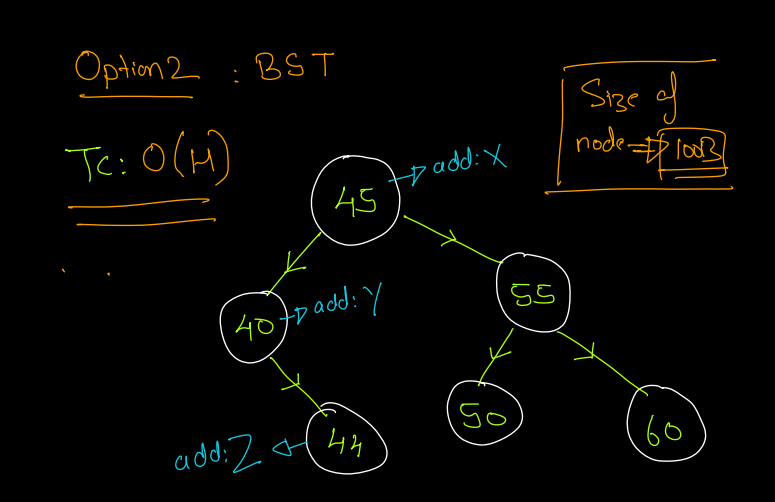
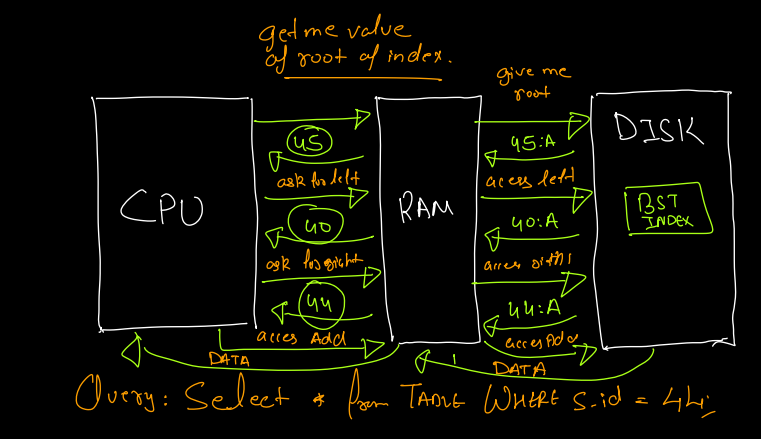
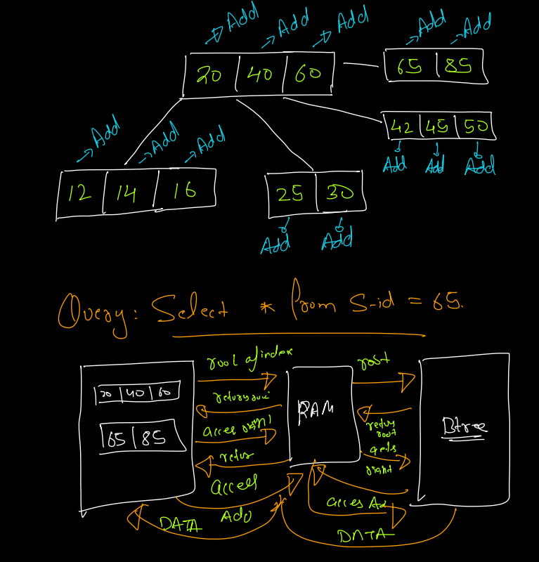
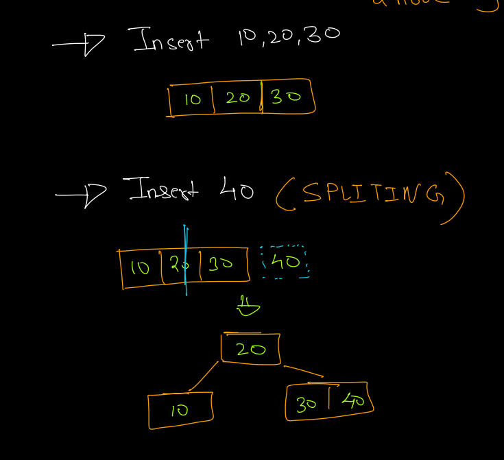
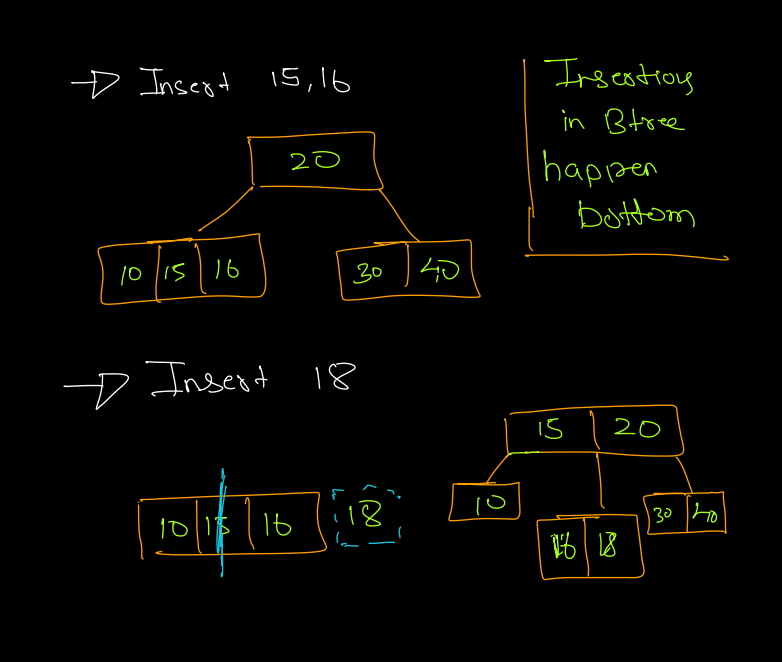
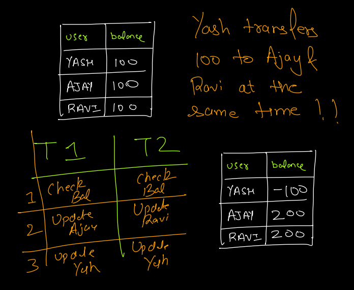
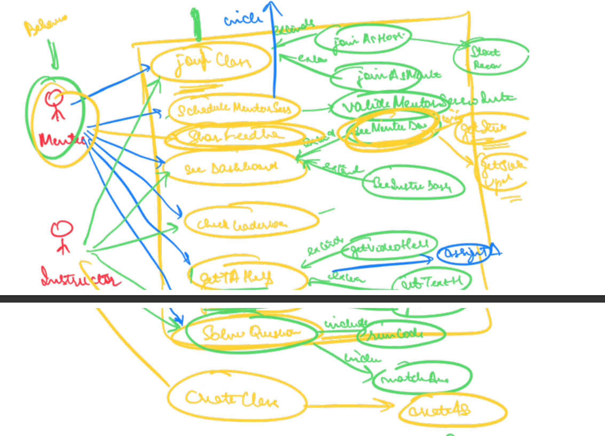

# Databases

## SQL Database 
Database where entities have relationships and data is mostly structured. They are represented in the form of tables

Eg: mysql, mssql, postgres, MariaDB

## NoSQL Database
Databases where the data is not structured and is represented using key-value pairs, document based etc.

Eg: MongoDB, DynamoDB, Cassandra, Firebase, Redis, Elastic Search

## Relationships

Cardinality is the relationship between two entities.

- 1 to 1
- 1 to many
- many to 1

## ER Diagrams

Also called entity relationship diagrams
- Entities : represented using rectangle
- Attributes: represented using ellipses
- Relationships: represented using diamonds
- link: represented using lines

## Super key

A composite key(one or more attributes) which can uniquely identify a row in database.

eg. [customer_id, aadhaar_no, license] - a super key

## Candidate key

A super key whose subset is not a super key, or the least form of super key.

eg.
- [aadhaar_no] - this is a candidate key
- [aadhaar_no, name] - this is a candidate key

## Primary Key
One candidate key can be chosen as the primary key for the table. Primary key once chosen cannot be changed.
- Primary key is automatically indexed

## Foreign Key
- Foreign key should be the primary key of some entity.
- Foreign key helps in establishing a relationship between two entities or tables.

## Normalization

Convert a table from unoptimal(has redundancy) state -> optimal state.

unoptimal entity -> 1 NF -> 2 NF -> 3 NF -> BCNF -> optimal entity.

When you normalize a table you break it into tables, which will reduce redundancy but impact performance because more joins will be needed. Therefore it is a business decision to what extend we want to normalize a database.

### Why normalization is needed?

X -> Y: X determines Y
We can say the  above only when X can uniquely identify Y. 

eg. student_id -> name : student_id can uniquely determine name, hence this is a functional dependency.

Trivial functional dependency: If you have something same on left and right, it is a trivial dependency.

### Properties of functional dependencies

- Reflexive: if Y is subset of X, then X -> Y
- Transitive: X -> Y and Y -> Z, then X -> Z
- Union: X -> Y and X -> Z then X -> YZ
- Decomposition : X -> YZ then X -> Y and X -> Z
- Pseudo-transitive: X -> Y and WY -> Z then XW -> Z

### Anomalies

- Insertion Anomaly - When you insert a row which spoils some attribute of the table.
- Deletion Anomaly - When deletion of some row also removes some important information
- Updation Anomaly - When you update some attribute for a row but end up updating more than the intended number of rows.

### 1 NF

- Attributes should have atomic values.

| id | address                     |
|----|-----------------------------|
| 1  | address1, address2, address3|

After converting to 1NF

|id|address|
|--|-------|
|1 | address1|
|1 | address2|
|1 | address3|

### 2 NF
Non prime attributes should be completely dependent on prime attributes. This basically means to break the table into two and join them using mapping table.

Prime Attributes: Attributes of a candidate key

Non-prime attributes: other attributes

### 3 NF
No non-prime attribute should be transitively dependent on a prime attribute.

s_id |s_name| s_pin| s_city| roll_no|
|----|------|------|-------|--------|
|1   | yash | 560037| Bangalore| 123|
|2   | raj  | 208005| Kanpur| 321|

Transitive dependency:
s_id -> s_pin and s_pin -> s_city

So this is not in 3 NF since there is transitive dependency in the table.

s_id |s_name| s_pin|  roll_no|
|----|------|------|--------|
|1   | yash | 560037| 123|
|2   | raj  | 208005| 321|

|s_pin|s_city|
|----|----|
|560037|Bangalore|
|208005|Kanpur|

Redudancy is reduced but performance is impacted.

### BCNF

Stricter version of 3 NF. States that any non-key column should not depend on a subset of primary key, it should depend on the entire primary key.

s_id | s_name | s_age + s_rollno

We chose s_id as prime attribute.

s_id -> s_name

s_roll -> s_name

s_roll is not a prime attribute. Therefore this is not in 3BCNF. This is because a non prime attribute is determining another non prime attribute.

s_id | s_name | s_age | s_roll_no |  

Anything defined on roll number will be put in roll number table

s_roll_no | x1 | x2 | x3

## Multiversion Concurrency Control (MVCC)

Multiversion concurrency control is a way to allow concurrent users access a particular row while it is being updated. Traditional DBs lock the database row when a write operation is going on. Therefore, users who want to read the row cannot do so because the lock has been acquired by a user who wants to write to that row.

MVCC solves this problem by assigning versioning to each row. When user A and B read the row, they read the latest version(let's say v1). When user C wants to write to this row, the DB creates a copy of that row and assignes it version v2. Once the transaction is complete, the next time A and B read the row they will read v2 and will get the updated value.

The advantage of MVCC is to eliminate locking of rows and enhance performance.

https://www.youtube.com/watch?v=iM71d2krbS4&ab_channel=CameronMcKenzie

## Indexing

It is a data structure techique to quickly retrieve and access data in database.
- primary key is indexed by default
- we can create indices on other columns to help retrieve data based on those fields faster.

Without indexing, you would need to iterate the entire table to get to the data row, resulting in a time complexity of O(number of rows). Rows in a database can be huge, so this is not scalable.

## Alternative 1  
What if we create a hashmap with key as the column and the value as the address of the row?

Disadvantage:
- A lot of storage will be used
    - 4 bytes per entry in HM * 10^9 rows = 4GB which is huge for RAM
- Range queries won't be optimized
    - Lets say we want rows with sid between 10 and 10^6 and total sids present are sparse and only 10^3.
    - We still would need to access all rows between 10 and 10^6 which is not optimal

## Alternative 2
What if we have data sorted? That can help in range queries
What if we store the data in a BST?

Advantages:
1. Can be stored in disk
2. Rabge queries are optimal

Disadvantages:
1. Too much disk I/O

Note: Hashmaps cannot be stored in disk because the data access is random and disk is more suitable for sequential disk reads.

## Alternative 3

Page: Smallest unit of fixed length contiguous block of physical memory
lets assume it is 4 KB
Size of 1 Node in BST << 4 KB
Therefore it makes sense to transfer more nodes together to RAM rather than just transfering the node requested.

B-tree: m-way tree which can have atmost m children and can store m - 1 values in a single node.
- Generalized form of BST
- Node values are sorted
- Node can have multiple values

TC: O(height of tree)

Also called FAT tree 

Advantages:
1. Less disk access as compared to BST

Insertion in B tree:

# ACID properties

Why we need?
So that we can ensure correctness and consistency of the data

## Atomicity

All changes to database are performed as a single operation

## Isolation

All the change to database happen in isolation. This is handled by the locking mechanism

1. Row level locking helps ensurane isolation
2. Column level locking is given by NoSQL DBs.

## Durability

Transactions that have been committed will be survive permanently.
- Updates will be stored in disk

## Consistency
Data is consistent before and after the transaction has been committed.
This is ensured by the developer while other properties are ensured by the database

# Schema Design

Schema design is a way to document the design of the database and helps in communicating how the database will be designed before actually implementing the design.
In schema design, we should use a common language of design which is understood by industry. This is done using UML diagrams which defines a language through which we can represent the database visually. This removes ambiguity from the discussion.

Important UML diagrams
1. Use case diagram
2. Sequence Diagram
3. Activity Diagram
4. Class Diagram

## Use Case Diagram

- Different set of use cases that are supported by a software system
- Who is going to use those services

### Actors
- Different entities which interact with the system to do actions

### How to draw use case diagram
- Create a box representing the entire software
- ovals represent the use case
- actors represent the customer, admin etc who will interact with the system
- arrows from actor to use case means that actor will perform that use case
- arrow with includes - If use Case A is needed to perform use case B, then A ->(includes) B For example checkout -> (includes) Payment
- extends - If for a particular use case A, we have multiple sub-uses like B and C. For example, signup <-(extends) SSO, signup <-(extends) email etc.

        

