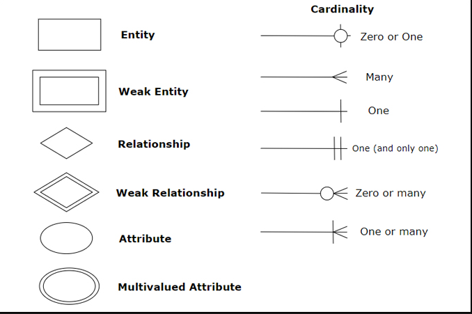

# Databases

## SQL Database 
Database where entities have relationships and data is mostly structured. They are represented in the form of tables

Eg: mysql, mssql, postgres, MariaDB

## NoSQL Database
Databases where the data is not structured and is represented using key-value pairs, document based etc.

Eg: MongoDB, DynamoDB, Cassandra, Firebase, Redis, Elastic Search

## Relationships

Cardinality is the relationship between two entities.

- 1 to 1
- 1 to many
- many to 1

## ER Diagrams

Also called entity relationship diagrams
- Entities : represented using rectangle
- Attributes: represented using ellipses
- Relationships: represented using diamonds
- link: represented using lines

## Super key

A composite key(one or more attributes) which can uniquely identify a row in database.

eg. [customer_id, aadhaar_no, license] - a super key

## Candidate key

A super key whose subset is not a super key, or the least form of super key.

eg.
- [aadhaar_no] - this is a candidate key
- [aadhaar_no, name] - this is a candidate key

## Primary Key
One candidate key can be chosen as the primary key for the table. Primary key once chosen cannot be changed.
- Primary key is automatically indexed

## Foreign Key
- Foreign key should be the primary key of some entity.
- Foreign key helps in establishing a relationship between two entities or tables.

## Normalization

Convert a table from unoptimal(has redundancy) state -> optimal state.

unoptimal entity -> 1 NF -> 2 NF -> 3 NF -> BCNF -> optimal entity.

When you normalize a table you break it into tables, which will reduce redundancy but impact performance because more joins will be needed. Therefore it is a business decision to what extend we want to normalize a database.

### Why normalization is needed?

X -> Y: X determines Y
We can say the  above only when X can uniquely identify Y. 

eg. student_id -> name : student_id can uniquely determine name, hence this is a functional dependency.

Trivial functional dependency: If you have something same on left and right, it is a trivial dependency.

### Properties of functional dependencies

- Reflexive: if Y is subset of X, then X -> Y
- Transitive: X -> Y and Y -> Z, then X -> Z
- Union: X -> Y and X -> Z then X -> YZ
- Decomposition : X -> YZ then X -> Y and X -> Z
- Pseudo-transitive: X -> Y and WY -> Z then XW -> Z

### Anomalies

- Insertion Anomaly - When you insert a row which spoils some attribute of the table.
- Deletion Anomaly - When deletion of some row also removes some important information
- Updation Anomaly - When you update some attribute for a row but end up updating more than the intended number of rows.

### 1 NF

- Attributes should have atomic values.

| id | address                     |
|----|-----------------------------|
| 1  | address1, address2, address3|

After converting to 1NF

|id|address|
|--|-------|
|1 | address1|
|1 | address2|
|1 | address3|

### 2 NF
Non prime attributes should be completely dependent on prime attributes. This basically means to break the table into two and join them using mapping table.

Prime Attributes: Attributes of a candidate key

Non-prime attributes: other attributes

### 3 NF
No non-prime attribute should be transitively dependent on a prime attribute.

s_id |s_name| s_pin| s_city| roll_no|
|----|------|------|-------|--------|
|1   | yash | 560037| Bangalore| 123|
|2   | raj  | 208005| Kanpur| 321|

Transitive dependency:
s_id -> s_pin and s_pin -> s_city

So this is not in 3 NF since there is transitive dependency in the table.

s_id |s_name| s_pin|  roll_no|
|----|------|------|--------|
|1   | yash | 560037| 123|
|2   | raj  | 208005| 321|

|s_pin|s_city|
|----|----|
|560037|Bangalore|
|208005|Kanpur|

Redudancy is reduced but performance is impacted.

### BCNF

Stricter version of 3 NF. States that any non-key column should not depend on a subset of primary key, it should depend on the entire primary key.

s_id | s_name | s_age + s_rollno

We chose s_id as prime attribute.

s_id -> s_name

s_roll -> s_name

s_roll is not a prime attribute. Therefore this is not in 3BCNF. This is because a non prime attribute is determining another non prime attribute.

s_id | s_name | s_age | s_roll_no |  

Anything defined on roll number will be put in roll number table

s_roll_no | x1 | x2 | x3

## Multiversion Concurrency Control (MVCC)

Multiversion concurrency control is a way to allow concurrent users access a particular row while it is being updated. Traditional DBs lock the database row when a write operation is going on. Therefore, users who want to read the row cannot do so because the lock has been acquired by a user who wants to write to that row.

MVCC solves this problem by assigning versioning to each row. When user A and B read the row, they read the latest version(let's say v1). When user C wants to write to this row, the DB creates a copy of that row and assignes it version v2. Once the transaction is complete, the next time A and B read the row they will read v2 and will get the updated value.

The advantage of MVCC is to eliminate locking of rows and enhance performance.

https://www.youtube.com/watch?v=iM71d2krbS4&ab_channel=CameronMcKenzie

