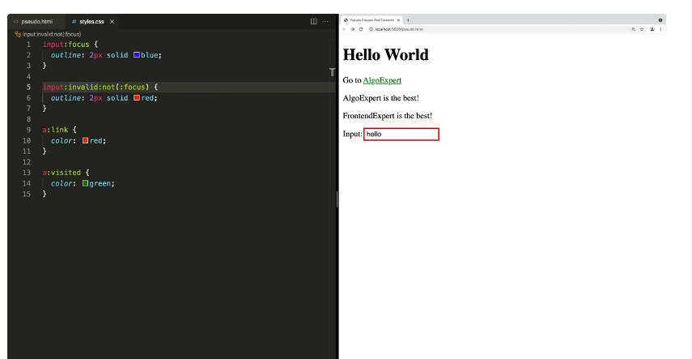
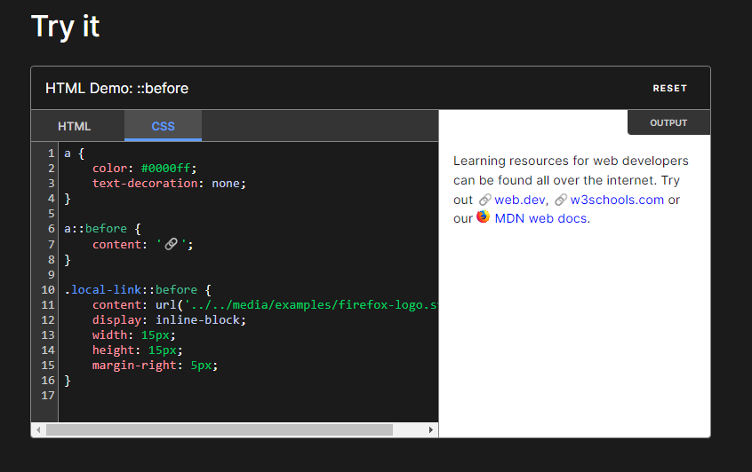
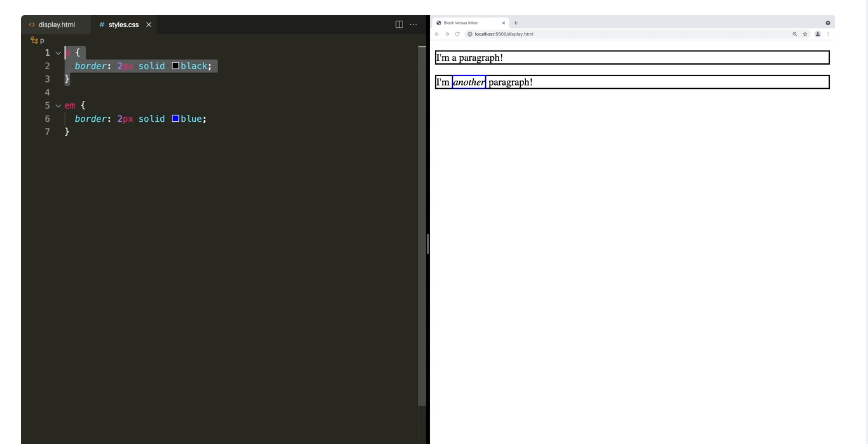
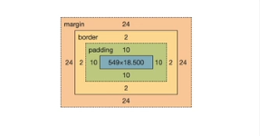

# CSS Basics

## Some Terms

### Declaration

a CSS property-value pair
```css
property: value;
```

### Declaration Block

a block containing many declarations

```css
{
    display: flex;
    color: red;
}
```

### Ruleset

A selector followed by declaration block

```css
selector {
    property: value;
    property: value;
}
```

## Selectors

```css
#id-of-some-element
.class-of-some-element
a[href="link"] /* this means select all links with value given in the bracket, this is called attribute selector */
a[href] /* this would select all elements with any href value*/
a[href*="algoexpert.io"] /*select all elements with algoexpert at any place in href*/
a[href$="algoexpert.io"] /*select all elements with algoexpert at end in href */
a[href^="algoexpert.io"] /*select all elements with algoexpert at beginning in href */

```
## Combinators
 
Use position of the dom an elements to select elements to apply css

```html
<section>
    <p> This is a paragraph inside section </p>
</section>
<footer>
    <p> This is a paragraph inside footer </p>
    <div>
        <p>This is not the direct child of footer</p>
    </div>
</footer>
```
```css
footer p {} /*this will only be applied to all <p> inside footer*/
footer > p {} /*this will only be applied to the direct children of footer*/
h2 ~ p {} /*select all <p> which are siblings of <h2>*/
h2 + p {} /*select all <p> which are adjacent siblings of <h2>*/
```

## Pseudo Classes and Elements
An addition to a css selector to select elements based on the current state. These start with ':'.
```css
button:hover {} /*select all buttons which are currently hovered over*/ 
```

An example:
In the below example, if we simply use two pseudo selectors on input without not, the user would see red border while typing because we have two pseudo selectors on input and so the second one would get applied.

We can use not condition which means "select input which is in invalid state and not in focus".



### Pseudo Elements

This applies to a specific portion of the element. These start with '::', so p::first-letter would select the first letter of paragraphs.

```css
a::before { content: '>'} /*before adds and an element before the a tag, in this case it will add the > before all a tags*/
```



## Selector Specificity

When you have conflicting styles, the most specific style will be taken. If specificity is same, the last style will be taken.

> !important : this overrides the selector specificity. You should avoid using this.

## CSS Units
- % : to be relative to parent
- vw/vh - to be relative to viewport
- rem - for close to absolute values (default page is 16px, unless someone changes it)
- em - to scale with font sizes
- px - for small values, last resort because it hampers accessibility.

Tips:
- In general prefer widths in terms of percentage so that your elements don't overflow.
- Dont use px for font sizes because it will not scale if the user has changed the default font size of their browser.
- Prefer using rgb() rather than hex value because it is easy to read.
 
## Block vs Inline:

Block elements default to
1. taking entire width of the parent 
2. default to new line

Inline elements:
1. Take the width and height of of the content.
2. You cannot change the width and height.

> You can change the behaviour using display: inline/inline-block/block attribute property.

inline-block :
1. These do not default to new line
2. You can change the width of the element

Example is paragraph


## The box model
- By default, vertical margins are collapsable - the maximum margin between two elements aligned vertical will be taken.
- By default, horizontal margins add up - the margin between two elements aligned horizontally is the sum of margins of both the elements.
- margin: auto means you let the browser handle the margins. This is usually used to center the element horizontally.
- vertical margins and padding have no effect on inline elements.



## Box sizing

When we say width: 100%, we are actually setting the width of the content. When you have a border and padding, these add up. Hence, you will see that the element would occupy more width than you set because the border and padding would add up.
You can use ```css width: calc(100% - border size)``` but this doesn't look neat. Another way to handle this is to use ```css box-sizing: border-box``` property. This makes the width take into consideration the border and the padding as well.