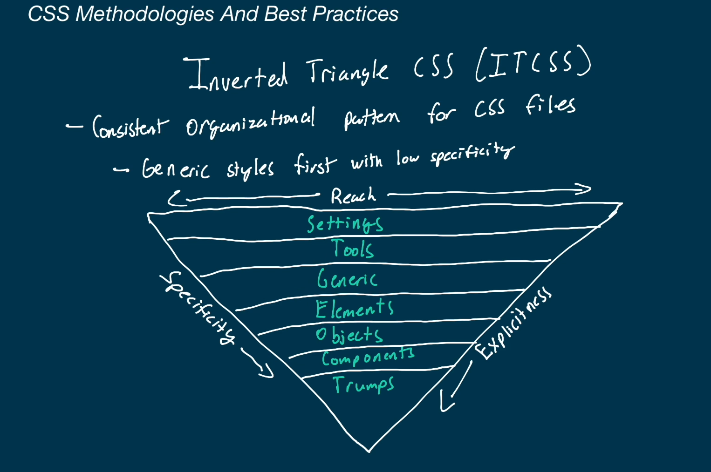

# CSS Basics

## Some Terms

### Declaration

a CSS property-value pair
```css
property: value;
```

### Declaration Block

a block containing many declarations

```css
{
    display: flex;
    color: red;
}
```

### Ruleset

A selector followed by declaration block

```css
selector {
    property: value;
    property: value;
}
```

## Selectors

```css
#id-of-some-element
.class-of-some-element
a[href="link"] /* this means select all links with value given in the bracket, this is called attribute selector */
a[href] /* this would select all elements with any href value*/
a[href*="algoexpert.io"] /*select all elements with algoexpert at any place in href*/
a[href$="algoexpert.io"] /*select all elements with algoexpert at end in href */
a[href^="algoexpert.io"] /*select all elements with algoexpert at beginning in href */

```
## Combinators
 
Use position of the dom an elements to select elements to apply css

```html
<section>
    <p> This is a paragraph inside section </p>
</section>
<footer>
    <p> This is a paragraph inside footer </p>
    <div>
        <p>This is not the direct child of footer</p>
    </div>
</footer>
```
```css
footer p {} /*this will only be applied to all <p> inside footer*/
footer > p {} /*this will only be applied to the direct children of footer*/
h2 ~ p {} /*select all <p> which are siblings of <h2>*/
h2 + p {} /*select all <p> which are adjacent siblings of <h2>*/
```

## Pseudo Classes and Elements
An addition to a css selector to select elements based on the current state. These start with ':'.
```css
button:hover {} /*select all buttons which are currently hovered over*/ 
```

An example:
In the below example, if we simply use two pseudo selectors on input without not, the user would see red border while typing because we have two pseudo selectors on input and so the second one would get applied.

We can use not condition which means "select input which is in invalid state and not in focus".


### Pseudo Elements

This applies to a specific portion of the element. These start with '::', so p::first-letter would select the first letter of paragraphs.

```css
a::before { content: '>'} /*before adds and an element before the a tag, in this case it will add the > before all a tags*/
```


## Selector Specificity

When you have conflicting styles, the most specific style will be taken. If specificity is same, the last style will be taken.

> !important : this overrides the selector specificity. You should avoid using this.

## CSS Units
- % : to be relative to parent
- vw/vh - to be relative to viewport
- rem - for close to absolute values (default page is 16px, unless someone changes it)
- em - to scale with font sizes
- px - for small values, last resort because it hampers accessibility.

Tips:
- In general prefer widths in terms of percentage so that your elements don't overflow.
- Dont use px for font sizes because it will not scale if the user has changed the default font size of their browser.
- Prefer using rgb() rather than hex value because it is easy to read.
 
## Block vs Inline:

Block elements default to
1. taking entire width of the parent 
2. default to new line

Inline elements:
1. Take the width and height of of the content.
2. You cannot change the width and height.

> You can change the behaviour using display: inline/inline-block/block attribute property.

inline-block :
1. These do not default to new line
2. You can change the width of the element

Example is paragraph


## The box model
- By default, vertical margins are collapsable - the maximum margin between two elements aligned vertical will be taken.
- By default, horizontal margins add up - the margin between two elements aligned horizontally is the sum of margins of both the elements.
- margin: auto means you let the browser handle the margins. This is usually used to center the element horizontally.
- vertical margins and padding have no effect on inline elements.


## Box sizing

When we say width: 100%, we are actually setting the width of the content. When you have a border and padding, these add up. Hence, you will see that the element would occupy more width than you set because the border and padding would add up.
You can use ```css width: calc(100% - border size)``` but this doesn't look neat. Another way to handle this is to use ```css box-sizing: border-box``` property. This makes the width take into consideration the border and the padding as well.

## Positioning

- position: fixed will make the element fixed even during scroll
- position: relative will make it relative to the surrounding
- position: sticky will make it stick to the top on scrolling
- position: absolute is similar to fixed just that it can be scrolled away. This is not valid when the parent of the element is position: relative.
- z-index: z-index is by default 0 which means it is at the base level. z-index uses a concept called stacking context to arrange the element.
- float: left will make the element and push it to the left size and allow other elements to wrap around whatever space is element.
- clear: both this will place the element below the float:right and float:left element
- clear: left this will palce the element below the float:left element only and it can wrap around the float:right element.

## Stacking context

Stacking context is used by z-index to arrange elements in third dimension. A group of elements together on the z-axis. Stacking contexts can be nested within other stacking contexts, and z-index values are used to determine the layering with teh same stacking context parent.


## Flexbox
Flexbox is a layout system for developing responsive websites.
Flex item works as follows:
- You assign display:flex to the parent of the flex items
- Only the immediate children of the element with display:flex become flex items
- flex-direction can be given to parent to change the axis of element. flex-direction can have the following values
    - row (default)
    - column 
    - row-reverse
    - col-reverse
- justify-content: specifies how flex items are arranged inside the parent
    - flex-end : everything will be pushed to the right side
    - space-around: evenly space the elements
    - space-between: evenly space the elements with no space in front and end
- align-items: same as justify-content but in the cross axis
- gap: 10px means there will be a gap of 10px between flex items.
- flex-wrap can have the following values
    - wrap : wraps the extra elements to next row
- flex-flow: row wrap is same as flex-wrap: wrap
- align-content: used to arrange rows in case of overflown items in second row when using wrap.
- order: used for flex items to order them in the flex layout
- flex-grow: if there is extra space how much should this element take up.
    - flex-grow: 1; means that red this flex element will take all the available space
    - flex-grow: 1 for two divs; means the two divs will use the available space equally. This is like weighted distribution
- other properties: flex-shrink, flex-basis
> To center the element, you can use justify-content: center and align-items: center


## Grid
A layout model used for creating responsive layouts of multiple rows and columns.An element can be made a grid container with ```css display: grid``` and all of its direct children will automatically be laid out as grid items.

A rectangle section of a grid is called grid area.
For grid containers, some common properties are:
- grid-template-columns: Determines the number of columns. The unit ```fr``` can be used.
- grid-template-rows: Determines the number of rows.
- grid-template-areras: Create names for areas that grid template items can place themselves in.

> learn more: [mdn docs](https://developer.mozilla.org/en-US/docs/Web/CSS/CSS_Grid_Layout).

## Images


Image sprite - A group of images all included in a single file. These images are usually split on the client using the CSS ```background-image``` property along with ```background-position```. The primary benefit of sprites is to reduce the total file size and the number of files the client needs to download, which can reduce the page load times.

## CSS Inheritance

All properties are either inherited property or non-inherited property
```color``` is by default an inherited property whereas ```border``` is not. 

We can set the inheritance for any property using the following values:
- inherit: The value should inherit from its parent.
- initial: The value should be set to the value definited in css specification
- unset: Tha value should be set to inherit if it is an inherited property, or set to initial.
- revert: revert back to the next stylesheet in the cascade.


## Responsive Design

Media queries are used to make your website responsive.

```css
@media (max-width: 800px) {
    // this block will run only when the width is <= 800px
}
```

This combines with grid layout can be used to make your website support mobile phones. You can arrange your layout to have more rows because most of the phones have limited width but they allowing vertical scrolling.
See the example below:


### Mobile First Design

It is generally a good idea to design your website with mobile design as the primary usecase. This is because it is easy to scale up a website than scale down and since more and more websites are consumed on mobile, it makes sense to optimise this first.

## Animations


## CSS Variables

CSS variables help you create variables which can be used across your project. Usually, you assign the variables in a ```css :root {}``` pseudo class.

```css
:root{
    --main-color: #ff0000;
}

h1 {
    color: var(--main-color);
}
```

## Frameworks and Preprocessors

- Frameworks: Pre-written code that can be used
- Preprocessors: Add language functionality

### Common Frameworks

- Tailwind: customizable utility classes
- Bootstrap: Responsive pre-built components, grid layout system.
- Materialize: Follows Google Material UI
- Foundation: Highly flexible UI components

You usually choose the design system based on the UI appearance.

### Common Preprocessors
- Sass: variables, mixins, @extends, nesting, looping
- LESS: JS based, less popular
- Sylus: similar to sass.
- PostCSS: highly customizable plugin collection

### Should you use frameworks and preprocessors?

Frameworks: Great for quick development but make sure you customize the component so that your website looks unique.
Preprocessors: Usually use them to simplify CSS

## CSS Methodologies and Best Practices

### Common Themes
- Stay consistent
- Keep separation from HTML
- Focus on responsive design, avoid absolute
- Respect the cascade, avoid !important
- Don't repeat your code (DRY)

### Block Element Modifier(BEM)


### Object Oriented CSS


### Atomic CSS


### Scalable And Modular Architecture for CSS (SMACSS)


### Inverted Triangle CSS(ITCSS)



## Performance Concerns

