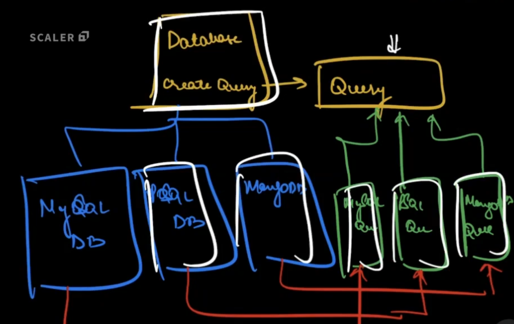

# Creational Design Patterns

## Singleton Design Pattern

- Singleton design pattern is used when you need just one object of a class throughout your codebase.
- Singleton pattern is commonly used in loggers, database objects etc.
- A database connection takes time and resources to create. I you use multiple objects of database in your codebase where it is not needed, you would waste resources. Singleton helps you save this resource.
- Singetons are used 
    - In classes which have no attributes. Eg. service, controllers and repositories.
    - Common resource behind the scenes. Eg. logging.
    - The class has attributes, but all of them have the same value in all the use cases.

```java
// Basic Singleton
class BasicSingleton {
    private static BasicSingleton basicSingleton;
    private BasicSingleton() {}

    public static BasicSingleton getInstance() {
        if (basicSingleton == null) {
            basicSingleton = new BasicSingleton();
        }

        return basicSingleton;
    }
}
```
- The above code will fail in a multi threaded environment.
- We are going to use double check locking to make it thread safe.
```java
// Singleton in multithreaded environments (Double check locking)
class MultiThreadedSingleton {
    private static MultiThreadedSingleton singleton;
    private BasicSingleton() {}

    public static MultiThreadedSingleton getInstance() {
        if (singleton == null) {
            synchronized {
                // the below check is neede because the first check is outside synchronized, hence singleton could be made non null by some other thread.
                if (singleton == null) {
                    singleton = new MultiThreadedSingleton();
                }
            }
        }

        return singleton;
    }
}
```
## Builder Design Pattern

- A class has many attributes and you cannot change the value of attributes once the object is created.
- You want some way of creating objects of that class such that you can set value of these attributes during object construction.
- The problem is you would have to define multiple constructors for various combinations of the attributes.

```java
// step 1: create class with its attributes.
class Sandwich {
    private int noOfBreads;
    private int noOfOnions;
    private int noOfPickles;
    // step 2: no constructor and only getters to make class immutable.
    public int getNoOfBreads() {
        return noOfBreads;
    }

    public int getNoOfOnions() {
        return noOfOnions;
    }

    public int getNoOfPickles() {
        return noOfPickles;
    }


    public static Builder newBuilder() {
        return new Builder();
    }

    public static Builder toBuilder() {
        Builder builder = new Builder();
        builder.setNoOfBreads = this.noOfBreads;
        builder.noOfOnions = this.noOfOnions;
        builder.noOfPickles = this.noOfPickles;
        return builder;
    }
    // step 3: create Builder inner class.
    // inner class needs to be static so that you can do Sandwich.
    static class Builder { 
        int noOfBreads;
        int noOfOnions;
        int noOfPickles;

        // step 4: define setters with return type as builder for chaining.
        public Builder setNoOfBreads(int noOfBreads) {
            this.noOfBreads = noOfBreads;
            return this;
        }

        public Builder setNoOfOnions(int noOfOnions) {
            this.noOfOnions = noOfOnions;
            return this;
        }

        public Builder setNoOfPickles(int noOfPickles) {
            this.noOfPickles = noOfPickles;
            return this;
        }

        // step 5: create build method to finally create the object.
        public Sandwich build() {
            Sandwich sandwich = new Sandwich();
            sandwich.noOfBreads = this.noOfBreads;
            sandwich.noOfOnions = this.noOfOnions;
            sandwich.noOfPickles = this.noOfPickles;
            return sandwich;
        }
    }
}    
```

### Uses of Builder Pattern
- You have to create an object of many attributes.
- You have to create immutable objects.
- You need validation before object creation (You can add that noOfBreads > 0 in build before creating the object.)

## Factory Design Pattern

- Factory is a code unit which is responsible for creation of objects.
- Let's say you want to write a code unit which gives the object of the desired database based on the string you pass. Something like this:

```java
void someFunction() {
    if (database == "mysql") {
        database = new MySql();
    } else if (database == "mongoDB") {
        database = new MongoDB();
    } else if (database == "redis") {
        database = new Redis();
    }
}
```
- Now, if you use similar if statement everywhere in your code and tomorrow you need to add another database, you would have to make changes to all the files. This can be a hassle.
- When to use a factory pattern:
    - Whenever I have an interface for whom there are multiple implementations and I need to select one of them based on the input.
    - The only purpose of this class would be to create objects.
- A factory will always return a new object.

### Practical Factory

```java
// step 1: create an interface 
interface TaxCalculationAlgorithm {
    public int calculateTax(SalaryDetails salaryDetails);
} 

// step 2: implement the interface based on different functionalities.
class OldRegimeTaxCalculationAlgorithm implements TaxCalculationAlgorithm {
    public int calculateTax(SalaryDetails salaryDetails) {
        // do tax calculation
        return tax;
    }
}

class NewRegimeTaxCalculationAlgorithm implements TaxCalculationAlgorithm {
    public int calculateTax(SalaryDetails salaryDetails) {
        // do tax calculation
        return tax;
    }
}

// step 3: create a factory which returns the implementation you need based on the input.
public class TaxCalculationAlgorithmFactory {
    public static TaxCalculationAlgorithm getTaxCalculationAlgorithm(TaxRegime regime) {
        if (regime == TaxRegime.OLD) {
            return new OldRegimeTaxCalculationAlgorithm();
        } else if (regime == TaxRegime.NEW) {
            return new NewRegimeTaxCalculationAlgorithm();
        } else {
            throw new IllegalArgumentException();
        }
    }
}

public static void main(String args[]) {
    TaxCalculationAlgorithm algo = TaxCalculationAlgorithmFactory.getTaxCalculationAlgorithm(TaxRegime.OLD);
}

```

### Factory Method Design Pattern

- In factory method design pattern, you have a class which is responsible for creating objects. 
- The return type of this factory method will be an abstract class. 
- Based on what class is implementing the factory method, the return type can be specified.
- All the return types of the factory method will be sub classes of the return type of factory method.



### Abstract Factory Design Pattern
- Let's say you have different UIs like material ui, ios and dark ui. All of these methods to create their own buttons, creator, create drop down etc.
```java
public class ThemeFactory {
    public static Theme createTheme(String themeName) {
        if (theme == "material") {
            return MaterialUITheme();
        } else {
            return IosTheme();
        }
    }
}

public abstract class Theme { 
    String authorName;
    String primaryColor;
    int lastUpdateDate;
    String name;

    public abstract ThemeComponentFactory createThemeComponentFactory();
}

public class MaterialUITheme extends Theme {
    public ThemeComponentFactory createThemeComponentFactory() {
        return new MaterialThemeComponentFactory();
    }
}

public class IosUITheme extends Theme {
    public ThemeComponentFactory createThemeComponentFactory() {
        return new IosThemeComponentFactory();
    }
}

interface ThemeComponentFactory {
    Button createButton();
    Menu createMenu();
}

class MaterialThemeComponentFactory implements ThemeComponentFactory {
    public Button createButton() {
        // create and return material ui button here.
    }

    public Menu createMenu() {
        // create and return material ui menu here.
    }
}

class IosThemeComponentFactory implements ThemeComponentFactory {
    public Button createButton() {
        // create and return ios ui button here.
    }

    public Menu createMenu() {
        // create and return ios ui menu here.
    }
}

public class Button {

}

public class MaterialButton extends Button {

}

public class IosButton extends Button {

}

public class Menu { 

}

public MaterialMenu extends Menu {

}

public IosMenu extends Menu {

}


```


## Prototype Design Pattern


