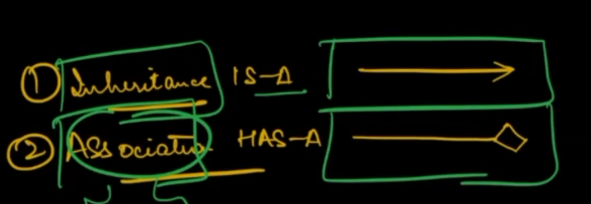
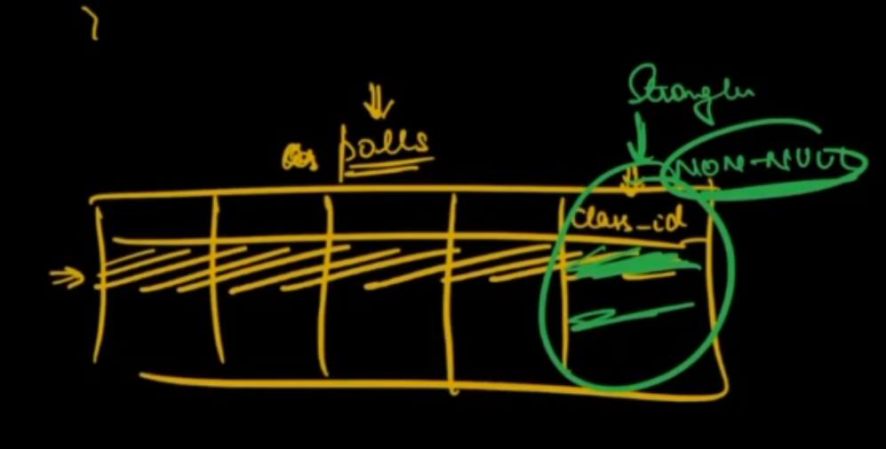
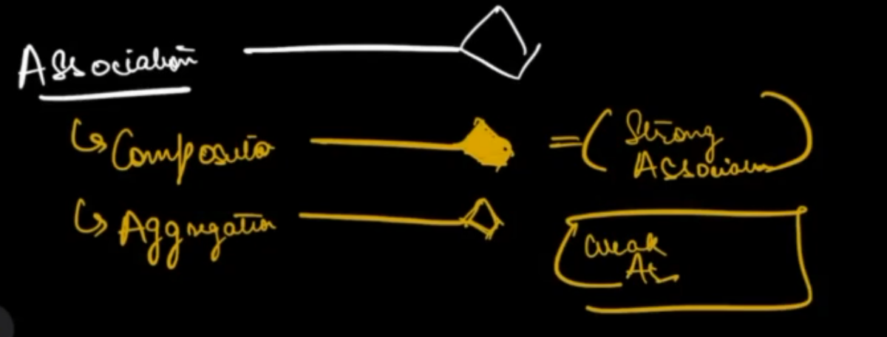
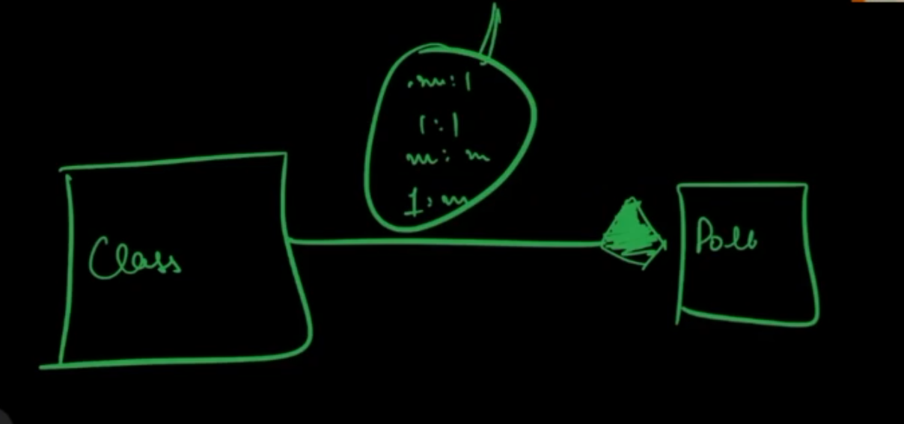

# Class and Schema Design

## Class diagram
- Represents differen entities that are there in the system
    - Class
    - interface
    - abstract class
- Also defines the relationship between the entities
- Class
    - name of class
    - attributes - you need to know modifier, data type and name. Symbols:
        - \+ : public
        - \- : private
        - \* : proctected
        - private int age: -> - age : int
    - methods
        - public Animal getAnimal(String name, int count) -> + getAnimal(String,int): Animal
        - We represent the method signature. Method signature never involves name of the parameter.
- Interface
    - <\<Name\>>
    - rest is same as class attributes
- Abstract class
    - Name is written in italics
    - abstract method name is written in italics
    - rest all the things are the same

## Class Relationships


### Association
Association is a "has-a" relationship where a class has characteristics of another class. For example, Flying bullet has characteristics of Bullet.

Association is of two types:
1. Composition: Composition means creation. A Class B has composition relation to class A when objects of B have no independent existence without class A. Composition is also called strong association. For example
```java
class College {
    class Branch {

    }
}

// Class Branch has no existence without College, hence it is a composition relationship.
```
2. Aggregation: Class A has aggregation relationship with Class B when Class B has independent existence. Aggregation is also called weak association.
For example, Car and Engine. Engine has an independent existence because it can be used in other cars too.

Note: most of the relationships are aggregation.
Note: In terms of schema, composition will mostly have a strong link in the form of non-null id to represent the relationship.




### Inheritance

Inheritance is a "is-a" relationhip where a class implements another class. This is shown by interface

### Dependency Inversion

No two classes can directly talk to each other, they can only talk through interfaces.

## Cardinality

Cardinality is the degree of "has-a" relationships for an entity. Whenever we represent a has-a relationship we should also represent the cardinality of the relationship.



## Schema Design

### Characteristics of Good Schema Design

1. Less redundancy
2. Fast Retrieval

### Steps for design
- Find the entities in the requirements. Entities can be users, courses, students, etc.
- Identify the attributes of the entities. Attributes can be name, email password, ids (if you want to persist in DB) etc.
- Draw Class Diagram
    - Determine the type of relationships between entities. For example, determine has-a (association or composition) and is-a relationships and draw them in the class diagram
    - Determine the cardinality. For example, 1:m, m:1, 1:1 or m:m. Represent them in the class diagram.
- Use cardinality to determine schema design
    - 1:m - Add the primary key of right table to the left table
    - m:1 - Add the primary key of left table to right table
    - m:m - Create a mapping table between left and right table
    - 1:1 - Add the primary key of any table to othe table

Sparse column problem: Let's say a Student can enroll in atmost 1 course. We have 1 million students and out of those only 100 have enrolled. That means in our schema design, the course_id column will mostly be null which results in wastage of space. In this case we can create another mapping table to save space.

So, in 1:m or m:1 relationships, if the relation is sparse then use mapping table.


