# Operating Systems

## Process

- A program under execution is called a process.
- The process tries to access resources.
- We need a mediator to distribute the resources optimally.


## Main job of an OS

- Memory management
- CPU scheduling 
- storage management
- security

## Multiprogramming

- Bring maximum processes to the RAM
- A single core CPU can achieve multiprogramming

## When a process leave CPU ? 
- After finishing execution
- Waiting for IO
- killed due to a bug

## Issues with the above 
- If a high priority process comes, then it might not be taken first.
- If a process is taking a lot of time, it might block other processes i.e. no time sharing allowed.

## Time sharing

- To fix the above, you can have a time quanta for the process. 
- When the time quanta is over, the other processes will get CPU.
- This approach is better than multi programming.

## Multitasking
- Doing two things at a time and switching between them without finishing the tasks.


## Non-preemptive vs Preemptive scheduling

- In non-preemptive scheduling, there is no time bound on process to leave the CPU.
- In preemptive scheduling, a process can leave a the CPU if it's time is over.
- **Multiprogramming + preemptive scheduling = multitasking**

## Multi - processing

- It is a hardware concept.
- We need multiple cores for this.
- Canot be achieved with one CPU.

## Process Control Block

- A data structure used by the OS to store all the information about the process.
- Structure of PCB
    - Process state
    - process number
    - process counter
    - registers
    - list of open files
- stored in kernel space in RAM

## Process states / Life Cycle

- When a process is started, it is in the NEW state. A PCB for it is created.
- Scheduler takes the process from NEW state, and push it to the RAM to bring them to READY state
- scheduler takes the process from READY state and moves it to the CPU. It will be in RUNNING state.
- If the process is performing IO, it will reach the WAITING STATE.

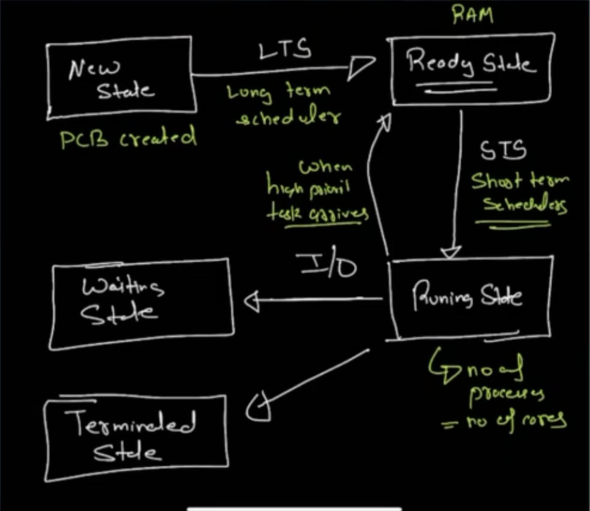


## Metrics to Measure Performance

### Throughput

- Number of processes that can be handled in 1 sec.

###  Response Time

- Time taken to start processing a task.

### CPU Utilization

- More CPU utilization, better the algorithm is.

## How to measure these metrics ? 

- **Arrival Time** : time of arrival of the process.
- **Waiting Time** : time for which the process was in waiting state.
- **Burst Time** : time needed to execute the process in 1 burst. 1 burst means assuming the process got all the cpu with no wait time etc.
- **Turn Around Time**: Time taken to complete a process. This includes wait time as well.
- **Completion Time**: Time at which the process got completed. The exact time.

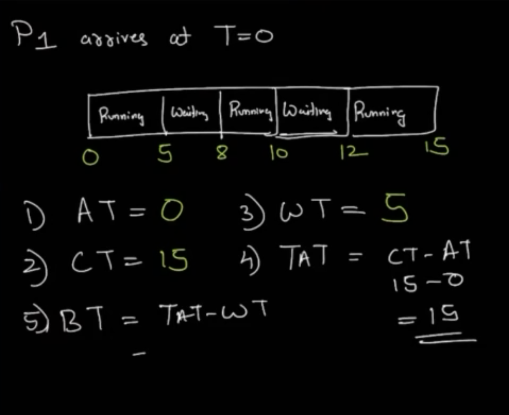

## Scheduling Algorithms

### FIFO

- First come, first serve.
- Non - preemptive

### Shortest Job First

- The process with the shortest burst time is selected first.
- Non - preemptive

### Round Robin

- This is preemptive.
- Each process is given a time quanta, under which it should execute.

## Memory Allocation

### Storage
- CPU can talk to the following storage spaces directly
    - Registers : Smallest and fastest
    - RAM : Slower but more space. RAM can talk to HDD/SSD
    - Cache : Faster than RAM.


### Execution of a Program

- When a program is compiled, it is converted into a machine readable form.
- Let's say a program when compiled takes 12Kb, Now you need 12Kb in RAM so that your code is loaded.
- We need allocation and deallocation because RAM is finite.


### Fixed Partition of RAM, Continous Allocation of process

- The OS developers made fix partitions of RAM to load processes in these partitions.
- A process cannot be broken.
- the partition of the RAM is made based on the number and size of processes.
- Each partition can hold only 1 process.
- If the partition is 4MB and process needs only 2MB, 2MB is wasted. this is called internal fragmentation.
- If the partitiona is divided variably, that is you allocate some space to a process and then to another process you allocate some space in a non contiguous manner, there would be some space left in between. This space might not be able to accomodate big processes. This is called external fragmentation.

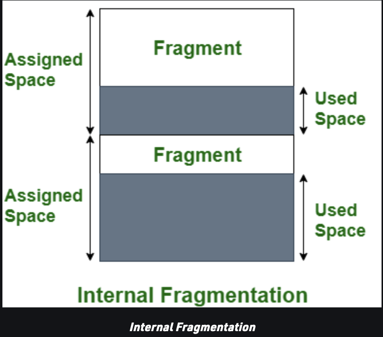

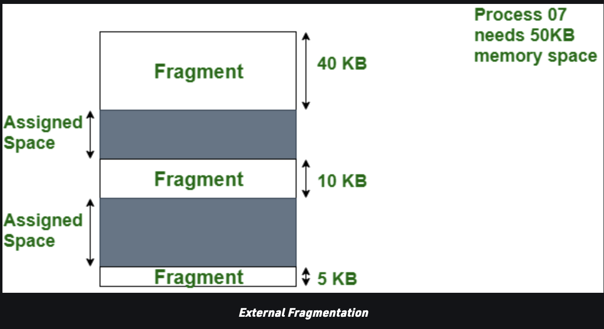


### Dynamic Partition, Contiguous allocation

- Since we are using dynamic partition, internal fragmentation is solved.
- Limit on process size is also removed.
- A disadvantage is when deallocation happens, holes would be created.
- Now a process which needs more ram than the hole cannot be accomodated. Hence external fragmentation is not solved.

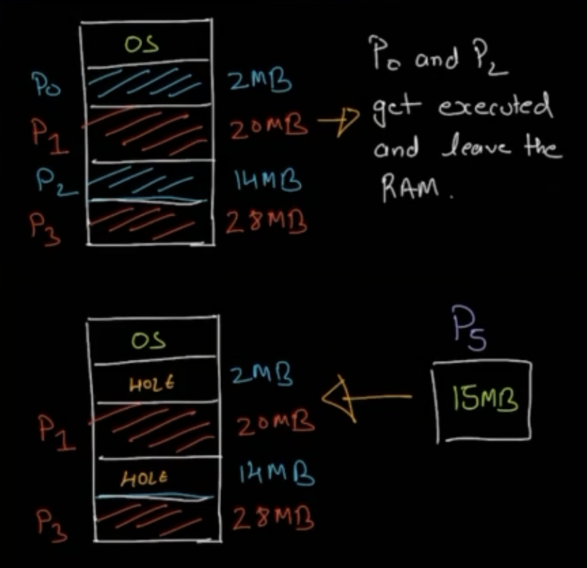

- The idea to solve external fragmentation is to use non contiguous allocation. 
- Even before a process is loaded on the RAM, we break the process into chunks of a fixed size(say 4KB). This fixed size is known as a page.
- The RAM is also divided into fixed pieces (lets say 4KB). This fixed size is called a page. 
- **Page size == frame size** , then only this strategy makes sense.
- The way, your process is loaded on the RAM, ready to be executed by the CPU.

## How will CPU access data?

- When CPU executes a process, Its PCB contains the program counter which shows which process is to be executed next. But we don't know the physical address or the frame no. 
- That is why we need a mapping from page to frame, this is done using a page table.
- We store the starting address of the frame, and the offset.
- The offset tells us at which line inside that frame, we should resume the execution( in case the current process is stopped)

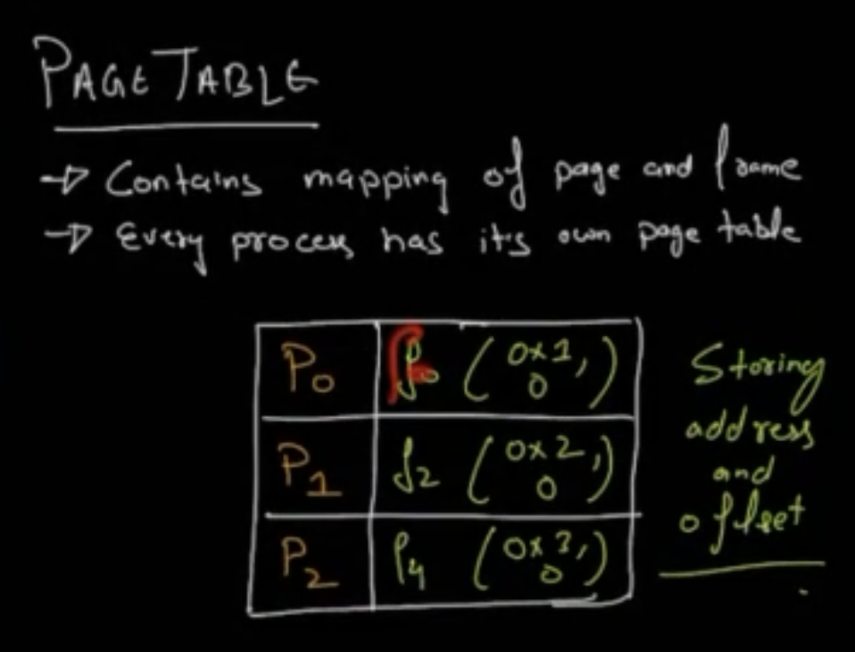


## Page Replacement Algorithms

- Sometimes, for a page to fit in, you need to remove some pages from the RAM, so that CPU can access it.


### FIFO

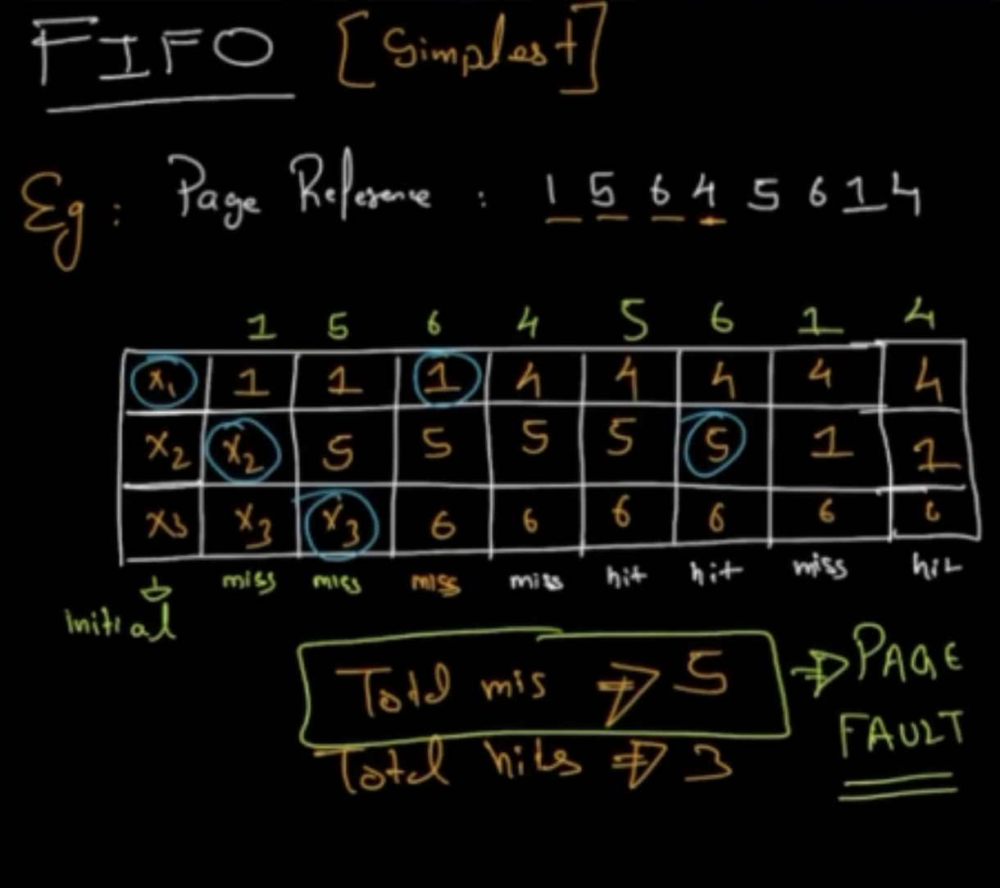


### Optimal Page Replacement

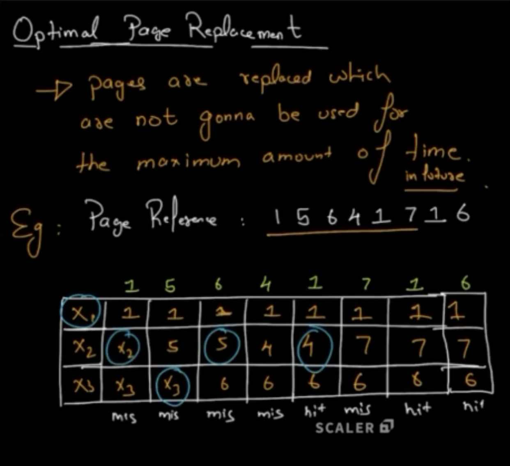

### Least Recently Used

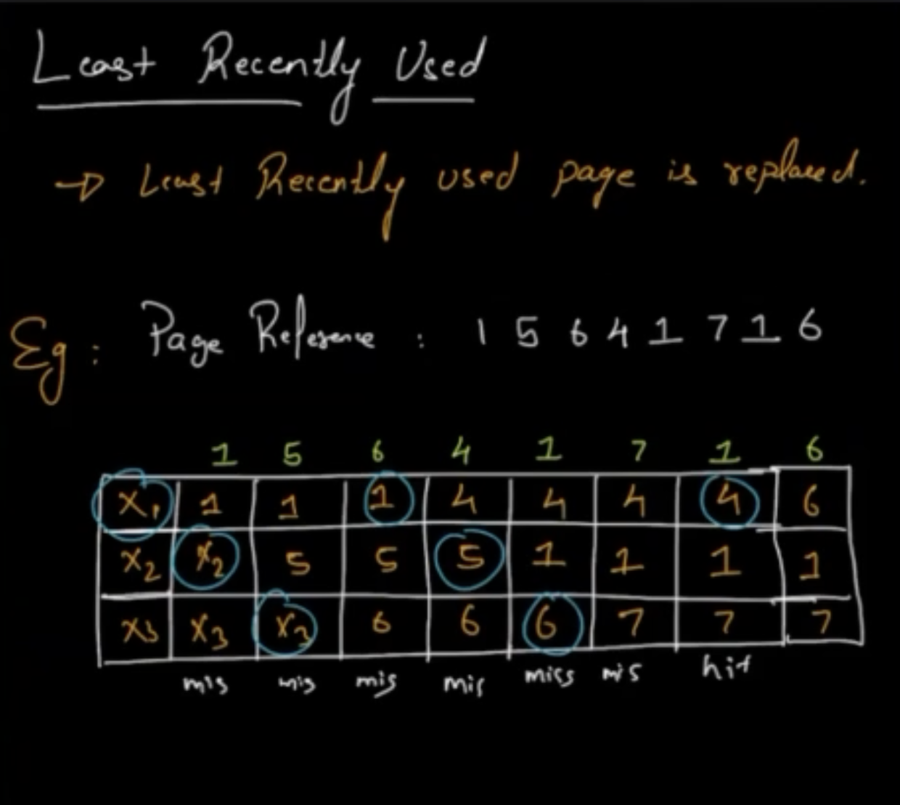


## Threads

- Basic unit of CPU execution.
- Comprising of 
    - Thread id
    - program counter
    - register set
    - stack
- A thread has a thread control block (TCB). This is linked to a PCB.

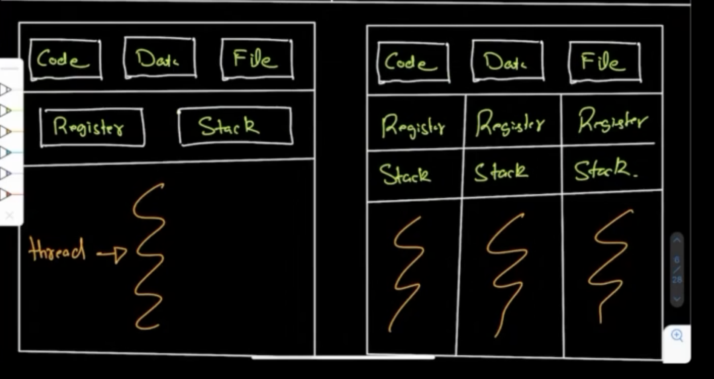

### Benefits of Multithreading

- **Responsiveness** - Your interactive application won't freeze even if a part of the code is taking a lot of time to execute.
- **Resource sharing** - Resources like code and data are shared between threads so it is more economical.
- **Exploits multiprocessor architecture** - Allows an application to have several threads of control within the same address. Context switching takes less time.

## Shared memory systems

- Multiple processes communicating with each other using the same region of memory. Processes can exchange information by reading and writing data to the shared region.

## Examples of problems with Shared memory

### Producer-Consumer Problem

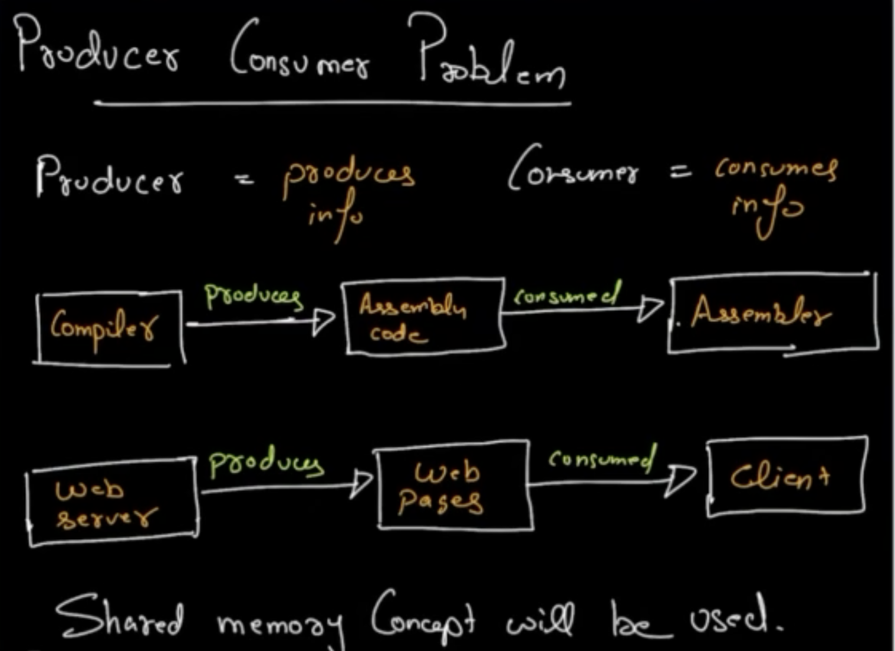

> Race condition: When different processes manipulate the same data concurrently and the outcome of execution depends on the particular order in which the access took place.


## Critical Section Problem

- Only 1 process would access the critical section at a time.
- Each process must ask for permission to go to the critical section.

### Solution to critical section problem

Must satify the following three requirements

- Mutual Exclusion - Only allow  1 process to enter CS at a time.
- Bounded Waiting - Each process should have limited waiting time. It should not wait indefinitely to get access to the critical section. This bound is on the number of processes. For eg, if P1 is waiting for the critical section, at max it will wait for 10 processes to execute before it. After 10, we have to give P1 the critical section.
- Progress - A progress has to be made, always.

### Peterson's Solution

- Classic software based solution.
- May not work in modern computers.
- Restricted to two processes.
- We need 2 data items to be shared between process 1 and process 2.
    - int turn --> Indicate whose turn it is to enter CS.
    - boolean flag[2] --> indicates the process is ready to enter CS or not.


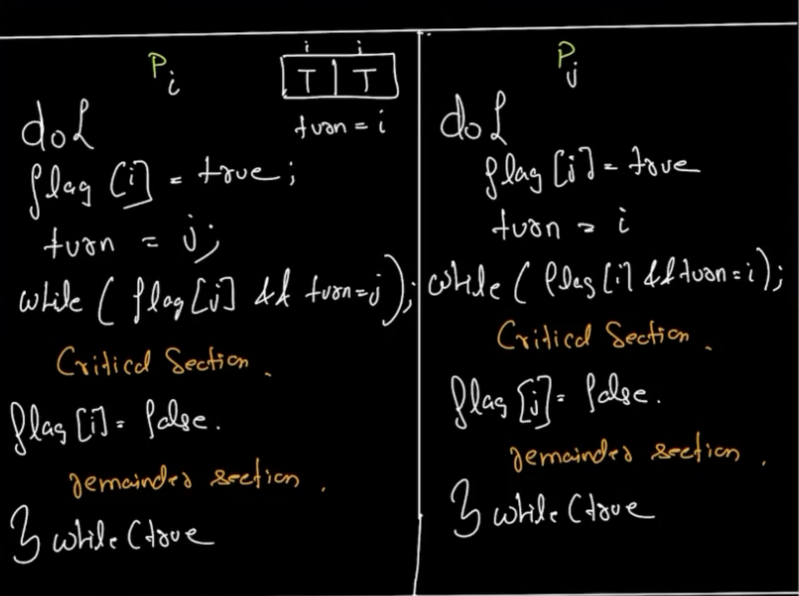

### Test and Set Solution
- This is a hardware solution.
- We have a test and set atomic method:
```java
boolean testAndSet(boolean target) {
    boolean ret = target;
    target = true;
    return ret;
}

do {
    while (testAndSet(lock));
    // critical section
    lock = false;
    // remainder section
} while(true);
```

## Semaphores

- semaphores can have integer value.
- using semaphores we can run many process together without causing race condition.
- Types of semaphores
    - binary : almost like mutex locks
    - counting semaphores : can have more than 2 values.
- We use two operations here, called wait and signal.
- wait is denoted by P and signal is denoted by Q.
- Semaphores don't ensure bounded waiting. 
```java
// wait() operation
P(semaphore S) {
    while(S <= 0);
    S--;
}

//signal operation
Q(semaphore) {
    S++;
}
```

### Counting semaphores
- It can have values ranging over an integer.
- It is used to control resources with multiple instances.
- It doesn't ensure bounded waiting. To solve this
    - we can push it to the waiting queue.
    - But waiting too much in the waiting queue can cause starvation.

## Deadlock

- Two process waiting indefinitely for an event that can becaused by one of the waiting process.

```java
wait(s)
wait(q)
// some work
signal(s)
signal(q)

wait(q)
wait(s)
// some work
signal(q)
signal(s)
```

### Necessary Condition for Deadlock
- Mutual Exclusion - There should be a resource which can be accessed by only one process at a time.
- No preemtion - You should not have an option for pushing the process to waiting queue and unblocking it.
- Hold and wait - There should be a process which is holding a resource and waiting for another resource.
- Circular wait - processes waiting for resources in a circular fashion


### Deadlock Detection

- **Deadlock ignorance**
    - Ignore the deadlock all together.
    - This is done because deadlock detection is a complex process and deadlock occurence is rare.
    - Your computer hangs less frequently and whenever it does, let the user handle it.
- **Deadlock Prevention**: Try to negate one of the necessary conditions for deadlock
- **Deadlock avoidance**: While allocating resource check if it is safe or unsafe. This is done by Bankers Algorithm
- **Deadlock Detection**: Detect the deadlock initially and then remove it.


