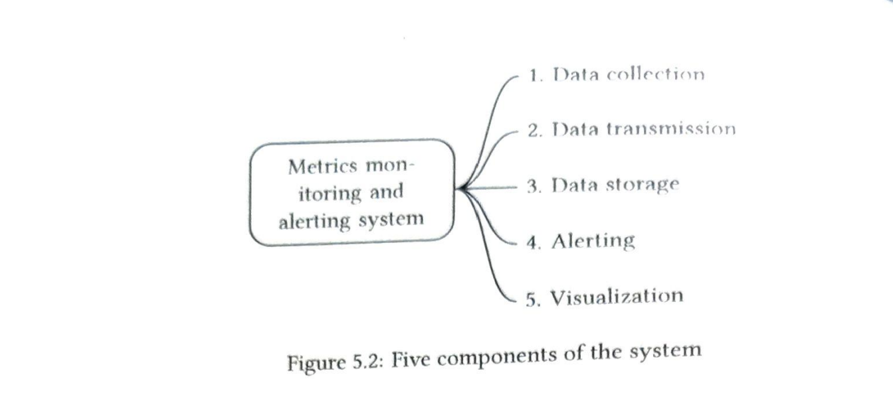
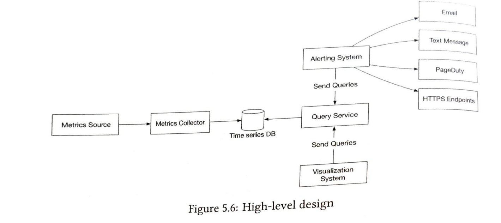
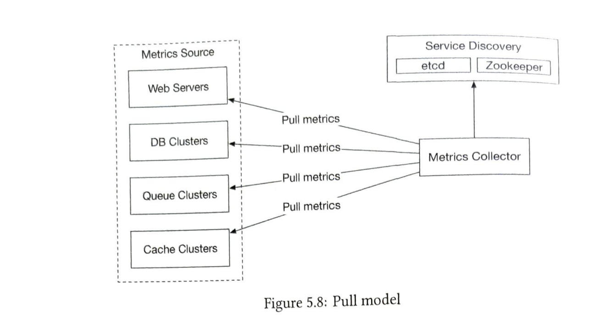
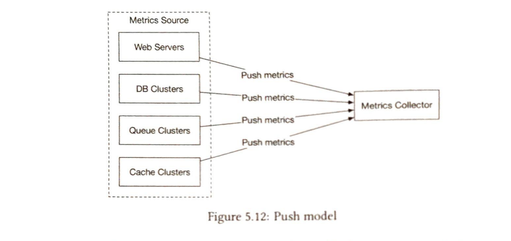
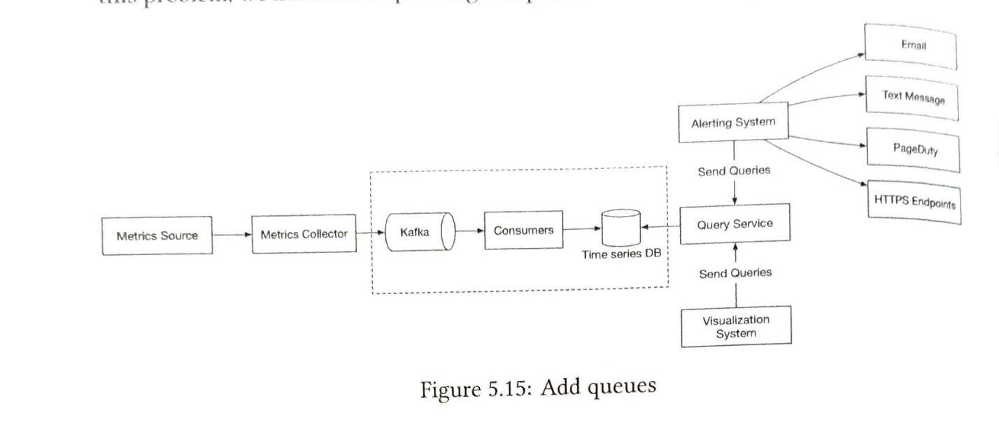
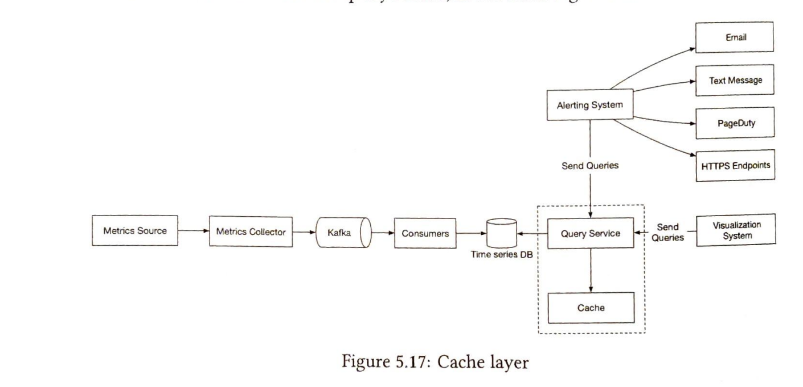
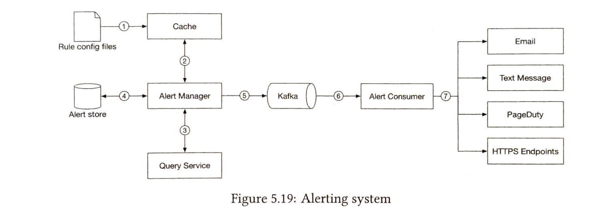
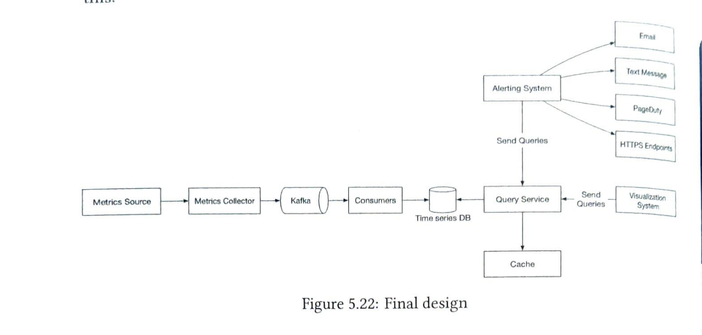

# Alerting and Monitoring System

## Functional Requirements

- Collection of operational metrics like CPU usage, memory usage, disk space consumption and other like requests per second for a server etc.
- Data retention for 1 year
- Data resolution should be full for 7 days, then 1 min for 30 days and further up by 1 hour after 30 days
- Notification channels: Email, webhooks etc.

## Non functional requirements

- Scalability : System should be scalable to accomodate growing metrics
- Low latency: The system needs to have low query latency for dashboards and alerts
- Reliability: System should be highly reliable to avoid missing critical alerts
- Flexibility: Flexible enough to integrate with new technologies

## Scale

- 100 million DAU
- 1000 server pools
- 100 machines per pool
- 100 metrics per machine
- 10 million metrics in total
- Data retention: 1 year

## High Level Design

### Fundamentals

We will have 5 major components:

- Data collection: Collect metrics data from different sources
- Data transmission: transfer data from source to metrics monitoring system
- Data storage: organize and store incoming data
- Alerting: analyze incoming data, detect anomalies and fire alerts
- Visualization: present the data in charts, graphs etc.

### Data model

- Metrics are repesented as time series data
- We use line protocol to represent the data
- The following fields are used
    - metric_name
    - set of labels
    - array of values and their timestamp

Eg:
- CPU usage
- host:i69
- timestamp: 123242435
- value: 0.34

### Data access pattern

- The system is write heavy because metrics are stored at a high frequency, aroung 10 million metrics per day
- The read load is spiky since alerting system and graphs might do a lot of read queries during certain times

### Data storage system

- We would need custom databases which handle time series data well because these databases can achieve the same level of performance as a traditional database with far few  servers.
- SQL DB might not be a good choice here since calculating moving average might be difficult in terms of query language.
- Relational DB might not perform well under heavy write load
- Indexing would be needed for each label
- Cassandra could be used but we would need to optimize it for time series data storage
- InfluxDB could be used here which is a time series database and provides its own query language which is suitable for time series data
- InfluxDB builds indices on the labels for fast query and aggregation operations

### High Level Design

## Design Deep Dive

### Metrics Collection

#### Pull Model

- The metrics collector pulls the data from the services
- The metrics collector needs to know the complete list of endpoints to pull data from
- The services can be registered in service discovery like Zookeeper which will keep a track of services to pull data from and any changes to them
- The metrics collector will contact Zookeeper to get a list of endpoints to pull data from and then call the those endpoints to collect the data
- The services need to implement a /metrics endpoint to expose the metrics data and might need to integrate with client library as well
- metrics collect can poll service discovery for any changes in endpoints or it can also register for listening for events generated as a result of changes in service endpoints.
- We would need to use multiple metrics collectors for scale and fault tolerance. How will we coordinate so that multiple collectors don't end up persisting duplicate data?
- We can use consistent hash ring for this

#### Push model

- A collection agent is installed on every server which is a long running software that collects the metrics and sends it to the metrics collector
- Collection agent may also aggregate the metrics before sending them to the metrics collector
- Aggregation reduces the volumne of data sent to the metrics collector
- If push traffic is high on the metrics collector, the collection agent can keep some data in buffer and send it later. This can also result in loss of data if the servers in autoscaling group and rotated out frequently.

#### Which one to choose?

- It depends on pros and cons
- Examples of pull model: Prometheus
- Examples of push model: AmazonCloud Watcha and Graphite

#### Comparison

- Easy debugging: /metrics endpoint exposed in pull model can be used to view the metrics being pushed anytime. Pull model is better.
- Short lived jobs: Some jobs might be shortlived hence pull model might not be able to pull the metrics. Push wins.
- Firewall: Pull model needs and endpoint to be exposed which might not be possible becasue it might need a complicated network solution. Push model sits behind a load model and anyone can push the data using that. Push wins
- Performance: Pull model uses TCP and push model uses UDP. Push model can provide low latency
- Auth: Push model needs some form of whitelisting or auth because any client can send metrics. Pull model metrics are always trusted since we already define the applications to collect the metrics from in the config file

### Scale metrics transmission pipeline

- We would need to have a cluster of metrics collector servers so that we can collect the enormous data received and there is not data loss due to unavailability.
- We can also introduce kafka between the time series database and the metrics collectors which will help act as a buffer in case the DB is not available.
- Kafka will give us the following benefits
    - Acts as buffer: Metrics data can fluctuate a lot. Kafka absorbs these spikes so that DB is not overwhelmed.
    - If DB is down, kafka can store the metrics data for sometime ensuring no data loss and making the system resilient.
    - Allows independent scaling of producers and consumers.

### Scale through kafka

- We can configure the number of paritions based on throughput requirements
- Partition metrics by metrics names, so consumers can aggregate data based on metrics names
- Categorize and prioritize important metrics so that those can be processed first. This can be done by create different topics for high priority and low priority metrics.

### Data aggregation

- Data aggregation can happen at different places
- Collection agent: The collection agent installed on the clients can aggregate and sent the results. This can only do basic aggregation like incrementing a counter before sending the data.
- Ingestion pipeline: Data can be aggregated and stored in the database. This will reduce the amount of data stored but will also reduce precious and flexibility since we won't have all the data. Flink(stream processing engine) would be used for aggregation since volume of data would be huge.
- Query side: Raw data can be aggregate on the query side and in this case there will be no data loss. Query speed might reduce since we would do aggregation every time a query is fired.

### Query Service

- We can have dedicated set of servers to access the TSDB and serve requests from alerting and visualization systems.
- These dedicated servers help us in decoupling the clients and the DBs and each of these can be scaled or changed independently.

### Cache layer

- Cache layer can be added to reduce load on TSDB

### Case against Query service

- The query service can be avoided as well if the alerting and visualization tools have plugins to use our TSDB 
- Caching can be avoided as well if we use the correct TSDB

### Query language

- Most TSDB don't use SQL because it is not optimized to write queries for time series data
- Influx is used as the query language of choice

### Storage layer

- Around 85% of queries are for data collected in the last 24 hours.
- If we can use this property in the database it can have huge impact on performance
- InfluxDB uses this data point for optimization

### Space optimization

- Encoding and compression: These techniques can be used to compress and store the data. TSDB already has these in-built.
- Downsampling: We can downsample the data as it gets old, based on the retention policy agreed:
    - 7 days data: No downsample
    - 1 month old data: Downsampled to 1 minute
    - 1 year old data: Downsampled to 1 hour
- Cold storage: Store very old data that is rarely used in cold storage

### Alerting system

- We can store alert configs written in YAML in cache servers.
- Alert manager reads these configs and sends the query to the query service at set interval
- If value violates the threshold, alert event is triggered
- Alert manager does the following:
    - Filter, merge and dedupe alerts: Many alerts might be triggered in a small interval of time so these needs to be deduped and only 1 alery event needs to be created
    - access control - has access control to stop unauthorized access
- Alert store keeps the created alert and its state and ensures alert is sent at least once
- alert event is sent to kafka and is consumed by alert consumer
- alert consumers send the notifications and emails

It is better to buy off the shelf alerting system rather than build your own

### Visualization system

- It is better to buy off the shelf visualization system rather than build your own. Grafana is a good option as it integrates well with TSDB.

### Final Design

