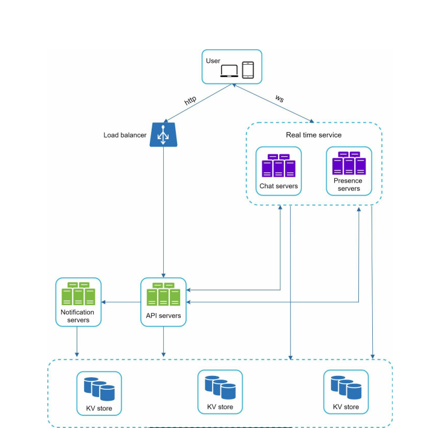

# Chat Application System Design

This problem covers the following  system design problems:
1. Messenger
2. Whatsapp
3. Telegram

## Design Scope

1. We should have 1:1 and group chats
2. Group chat limit is 100
3. DAU is 50 million users
4. Support sending documents and other media as well
5. Online indicators like active and last seen
6. end-to-end encryption
7. Chat history storage
8. push notifications

## High level design

### Chat service

Each client doesn't communicate with each other. Client sends the message to a chat service which relays the message to the correct recipient.

**Choosing the right protocol**

- HTTP protocol could be used on the client side because it is the client which will initiate the message and send the message to the server. The client can include a "keep-alive" header to keep the connection open and avoid addition TCP handshakes.
- Receiver side cannot use HTTP because it is a client-initiated protocol.
- Polling: The client checks with the server if any messages are available. Polling could be costly depending on the frequency
- Long polling: The client opens a long polling connection with the server and keeps the connection open until new message is received or timeout occurs. There are a few drawbacks
    - HTTP based servers are stateless. if we use round robin load balancing, the server which receives the message might not have long polling connect with the client who receives the message
    - A server has no way to tell if the client disconnected.
    - It is inefficient if the user does not chat much
- Web socket: Web socket allows birectional message flow between the client and server and is the best choice for async flow of messages. The only thing we need to be careful about is connection managemement on the server side since web sockets are persistent connections.

### Stateless and Stateful services

We can divide the chat application into a bunch of stateful and stateless services

Stateless services: Login, group management, user profile, service discovery etc. can use traditional http request/response protocol and can be stateless.
Stateful services: Chat service uses web sockets so should be stateful

### Scalability
- All services could fit in one cloud server but the challenge is the number of connections for chat service. Each connection could take 10KB memory so for 1M users approx memory required would be 10GB(could fit). We would still not want a single point of failure

### Storage

- First point to choose is the type of database: SQL or NoSQL
- We need to example the data types and read/write patterns
- Data types can be of two types. One is the generic data like user profile, settings etc. which can be stored in SQL databases.
- Availaibility can be handled by replication and scalability can be solved by sharding
- Another type of data is chat history. Patterns are that users are more likey to look at recent chat history but might use features like search
- Read:write ratio is 1:1 for 1on1 chat
- For chats, we can use key value stores like HBase(used by Facebook) or Cassandra(used by discord). These allow easy horizontal scaling, low latency data access, relational databases don't handle long tail of data well because random access becomes expensive when index grows in size.
- Choice of DB for chat depends on the scale of the system. If the system is small, SQL database would work fine. But if the chat scale can be large, we can use something like Cassandra which can scale more easily and is based on write-heavy work.

### Message ID generation

- MessageID is used to sort the messages in order for 1on1 and group chats.
- MessageId generation can be done in the following ways:
    - Use auto-increment: This cannot be used in case of Nosql databases because they don't have this feature built in
    - Use timestamp: Two messages can be generated at the same time.
    - use global Id generator: Snowflake could be used but it is overkill for this problem
    - Use local Id generator: Local ID generation would be sufficient because we only need unique Ids for 1on1 and within  a group chat only.

### Choosing the Chat server
- The clients need to choose the chat server to which they will open a web socket connection.
- Service discovery is required so that the best chat server can be provided to the clients based on the geography, load on chat servers etc. Zooper can be used for service discovery here.

### 1 on 1 chat

### Message synchronization across devices
- A user can have multiple devices like phone and laptop.
- Each device maintains a max_current_msg_id.
- if latest(message_id) in KV > max_current_msg_id, the pending messages are synced from KV store to the device.

### Small group chat(max 100 users)
- Each user will have it's own message sync queue.
- Let's say therer is a message posted by User A and there are three users in group A, B, C.
- A's message would be copied to queues of B and C. 
- Both B and C listen on their respective queue, so they would know that A has sent a message.
This works for a small number of members in group because copying of messages is not that expensive and approach is simple.(WeChat also uses this for user groups with 500 users)

### Online status indicator
- We need to indicate online ,offline and last_seen
- When a user establishes a WS connection, we can have presence servers which will mark the status as online and store the timestamp in the KV store.
- When a person logs out, the API server will inform presence server so that status would be changed to offline ans last_seen would be updated.
- When a user disconnectes, we cannot simply change the status to offline because internet breakages are frequent so this would make the indicator change quite often and will not be a good user experience. We can send regular heartbeats to the presence server(say every 5 secs) and if the user doesn't receive a heartbeat for a given time interval(let's say 30 secs) we mark the status: offline.

### Online status fan out

For big groups:
- Only fetch the status when user enters group chat or refreshed friends list.

## Media texts
- We can first upload the media on the cloud storage and send the media url as the message
- On receiver side the url message can be used to fetch the image
- compression, cloud storage and thumbnails could be good discussion points here.

## End to end encrpytion
- We can do end to end encrpytion using private and public keys.
- Message can be encrpyted using a public and private key on the phones itself.
- Sender encrpyts the message using the public key of the receiver. 
- When receiver receives the message, it decrpyts the message using it's private key.
- So whatsapp uses asymmetric encrpytion.

## Error handling
- Zookeeper will take care of assigning a new chat server in case the current server goes down.
- Messages will be retried before failing to send.

# Open questions and TODOs:
1. When to choose a key value database over relational database?
2. Why cassandra is more suitable for write heavy work and scale easily as compared to sql databases?
3. Create common tips doc for system design and zookeeper as the choice for service discovery.
4. What about large group chat(>500)?

