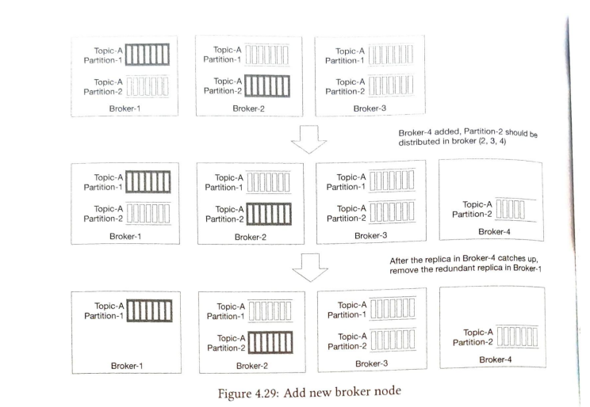

# Distributed Message Queue

## Functional Requirements

- Producers can send messages to queue
- Consumers can consume messages from queue
- Delivery semantics
  - At least once
  - Exactly once
  - At most once
- history data can be truncated
- message size is in kb
- Ability to deliver the message in order they were added in the queue

## Non functional requirements

- High throughput or low latency which can be configured
- Scalable
- Persistent and durable: Data to be stored on disk and replicated to multiple nodes

## High level design

> Note: Traditional messaging queue are event streaming platforms which only maintain messages in memory long enough for them to be consumed. Disk write happens only in case of overflow. Messaging ordering is also not guaranteed.

### Messaging models

### Point 2 point

- One message can be consumed by only one consumer
- Once the message is consumed and ack'ed by the consumer, the message is removed from the queue
- Message is maintained in-memory only till the message is consumed

### Publish subscribe

- There is a concept of topics which are categories to hold messages.
- Subscribers subscribe to topics
- One message can be consumed by many subscribers
- We can also support point to point model using the concept of consumer groups

### Topics, partitions, and brokers

- Topics are divided into parititons for scalability
- Paritions are distributed among a set of servers called brokers
- Each partition behaves like a FIFO queue
- Position of a message in partition is called offset
- Message is sent to the topic, it is actually sent to a parition based on the message key
- When a consumer subscribes to a topic, it pu  lls data from one or more of these partitions.
- When there are multiple consumers subscribing to a topic, each is responsible for a subset of partitions. This is called consumer group.

### Consumer group

- A consumer group is a conceptual group of consumer which subscribe to some topics.
- For example, a consumer group for billing messages.
- A consumer group can consume messages from many topics
- Each consumer group maitains its own offset which tells to what message number the message has been consumed
- Therefore a single message can be consumed by multiple consumers since two consumers belonging to different consumer groups will have different offset
- consumers in a group can consume messages in parallel. This can cause problems like ordered consumption of messages cannot be guaranteed.
- We can add a constraint that a parition will only have 1 consumer in that group which will ensure that all messages are consumed by one consumer and hence they are ordered
- The above makes it point to point model
- If number of consumers are larger than paritions in a group, some consumers will sit idle

### High level architecture

## Design deep dive

- Design focuses on batching. Producers batch the request, brokers stored the messages in batches and consumers consume the messages in batches.
- We want high throughput with persistence
- Message are transferred from producers to consumers with no modification to avoid copying small data

### Data storage

- System is read-write heavy
- no update or delete operations
- sequential data access

Choices for persistence

1. Database: It is difficult to find a database which is write and read heavy at scale
2. Write ahead log: WAL is file which only allows appending lines to the end of the file. WAL have purely sequential access so the disk performance is really good.

### Segmentation

- WAL cannot be one huge file so we need segmentation
- Only the active segment allows write request
- Inactive segments serve read requests
- If a server is inactive for a long time, we can truncate the segment to clean data
- segments of a partition are arranged inside folders

> Note: Sequential access of data makes read-write quite fast even on disk. Disk is usually slow when we do random access

### Message data structure

The idea here is to avoid copying of data becaus at our scale it can be costly. The message has the following fields:

- key byte[]
- value byte[]
- timestamp long
- size long
- topic string
- partition int
- offset long

### Message key

- Messaging key is used to find the partition where the message should go based on consitent hashing
- If key is not given, a partition is randomly choosen
- User can define its own hashing algorithm as well for even distribution
- Hashing algorithm will distribute messages evenly even if we increase the partitions
- keys might not be unique

### Message value

- this is the actual payload of the message

### Other fields of message

- topic, partition, offset
- We can find a message using topic -> partition -> offset

### Batching

- Batching is very imporant in this system because of the scale
- We can batch messages on producers and send multiple messages in one batch to save network io
- We can batch messages while writing to WAL where we can write many logs in chunk. 
- This will increase throughput
- There is a tradeoff between latency and throughtput. If we want to improve latency, we need to reduce the batch sizes which means we might need more paritions since more requests would come in

### Producer flow

- We need to decide which broker the producer should connect to?
- This can be handled by a routing layer whose job is to route the message to the correct broker. We can have it as a separate service or make it part of the producer library to reduce network hops
- We can also introduce a buffer in the client library which will hold messages for sometime and send them in a batch.
- Throughput and latency will be a tradeoff in batching. If we increase the batch size, we can send a lot of messages in a single request which will increase the throughput. But latency would reduce because creating a big batch will take time.
- If we reduce the batch size, we can send messages quickly which will decrease the latency but reduce throughput. We can keep the batch size configurable and the users can choose between latency and throughput.

### Consumer flow

- Consumers use offset to keep a track of till where the data has been consumed from the queue.

We can have push model and pull models for consumption of data

#### Push model

In this, the broker pushes the data to the consumers when the data is received

Pros:
- There is not wait time since the data is immediately pushed

Cons:
- If rate of consumption < rate of production, the consumers can get overwhelmed.

#### Pull model

The consumers pull the data from the brokers

Pros:
- Since consumers control the rate of consumption, we can control the batching and decided at what rate we want to consume.
- If rate of consumption < rate of production, we can simply add more consumers or control the rate of consumption

Cons:
- The consumers would poll the brokers and it might happen that there are no messages to consume, so unnecessary calls are made. This can be reduced by long polling

#### Rebalancing

When a new consumer joins:

1. Each consumer sends heartbeat to the coordinator to let it know that it is alive.
2. When a new consumer joins, the cooridinator asks all the consuemrs to rejoin via the reply for their heartbeat.
3. Coordinator chooses a consumer as the leader and informs it about all the active consumers.
4. The leader consumer creates the distribution plan and sends it back to the coorindator.
5. The coordinator then sends back the new plan to all the consumers

Why the distribution plan is prepared by the leader consumer and not by the coordinator?

- This is because the consumer is closer to the data and hence it can use various parameters to make a better plan
- Fault tolerance

When a consumer leaves:

- When a consumers leaves, the coordinator knows about it from the heartbeat.
- All other consumers are asked to rejoin.
- One of the consumer is selected as the leader and asked to create the distribution plan
- The consumers are informed of the distribution plan and they start consuming based on the new plan

### State storage

States here represents the consumer or consumer group offsets for each partition and the mapping between partitions and consumers

Data access patterns are as follows:
- Frequent read and write operations
- data is updated frequently
- consistency is important

We can use KV store like Zookeeper to manage states.

### Metadata storage

Metadata 
- Retention period
- number of partitions
- distribution of replicas

This data is small and is not updated frequently, but we need consistency. Zooper is a good choice.

### Zookeeper

Zookeeper is an essential component of a distributed messaging queue. It provides
1. Distributed configuration service
2. Synchronization service

It simplifies our design as follows:
1. Metadata and states are stored in Zookeeper
2. Zooper will help with leader election of broker cluster
3. The broker only needs to maintain data storage for messages

### Replication

- Each partition will have 3 replicas
- The messages are sent to the leader replica
- The follower replicas constantly pull the data to stay in sync
- When a given number of replicas are in sync, the leader returns back the response and the message is ready to be consumed.

- Replica distribution plan (which means which replica will be stored in which broker) is created by the co ordination service. 
- Coordination service elects the leader broker which creates the partition replica distribution plan and stores it in the metadata storage
- Other brokers can obey the plan in the metadata storage

### In-sync replica

In sync replicas means that the replicas which are in sync with the leader. We can specify replica.lag.max.messages=3 which means that the replicas which are behind by less than 3 messages are considered in sync.

ISR are needed because using them we can choose between latency and durability
- If we need no loss of messages, we can choose all replicas to be in sync
- If we need low latency, then we can choose less replicas to be in sync

#### ACK settings

ACK = all

- This means that the message would be sent to the consumer only when all the replicas are in sync
- This increase the latency but will offer max durability

ACK=1

- The producer receives ack once the leader persists the the message
- This means if the leader goes down immediately after sending ack, message would be lost
- This is suitable for low latency systems where some data loss is acceptable

 ACK=0

 - The producer doesn't wait for ack and keeps sending them messages.
 - This is useful for very low latency systems where potential data loss is acceptable
 - This is useful for metrics collection or logging data since volume is high and data loss is acceptable

Consumer side:

- Consumers connect to leader replicas because of design simplicity(since leadre is always ISR). Since message in one partition is always dispatched to one consumer within a consumer group(for ordered process and avoiding same message to be processed by multiple consumers). This means that very limited connections are there for leader replica
- the number of connections to the replica is as not large unless the topic is super hot. If the topic is hot, we can increase the number of partitions and consumers.

### Scalability

#### Producer

Scalability can be achieved by increasing the number of producers since no coordination is needed here.

#### Consumer

- Consumer groups  are independent of each other so we can easily add more consumer groups
- Within a consumer group, increase and decreasing of consumers means that rebalancing has to take place.

#### Broker

- When a broker goes down, there the coordination service knows about it and the leader broker creates a new distribution plan and others follow that plan.
- replicas should be stored on different brokers for fault tolerance in case a node goes down
- They should also be stored in different data centers to further increase the fault tolerance in case the data center goes down. This will increase latency of replication and synchronization
- When a new broker is added, we temporarily increase the number of replicas and add new replicas in the new broker based on replica distribution plan.
- After the new broker is all caught up, we can remove the redundant replica from broker 1.

#### Partition

- We might increase the number of partitions. When we change the number of partitions, the consumers will be notified when they communicate with the brokers and consumer rebalancing will be triggered
- After rebalancing, consumers will start consuming from the new alloted partitions.
- Deleting a partition is more complicated. We will decommission a partition so that new messages are not pushed to this partition. Once the retention period is over, the partition can be deleted.

### Data delivery semantics

#### At most once

- producer pushes the messages and doesn't wait for ACK (ACK = 0). Message may be lost but that is acceptable.
- On the consumer side, the message is consumed and commits the offset before processing the message.
- This is used in metrics collection and logging data.

#### At least once

- This will be sent with ACK = 1 or ACK = all based on how much durability we want.
- The data is consumed by the consumer and offset is commited only when the data is processed. This is to ensure that data is received
- If the consumer fails, the message is consumed again.

#### Exactly once

- Difficult to achieve and used in financial services where data loss and duplication is not acceptable
  
## Advanced Features

### Filtering messages

Sometimes the consumer might need to process messages of a subtype within a topic. For example, ordering system pushes all order messages to the topic and consumers like payments needs to process payment related messages.

- We can create topics for payments system and ordering systems. But this would increase the number of topics by a lot since we would need to create topics for every subtype
- Duplication of messages in various topics
- The producer code needs to change everytime a new consumer requirement comes as producers and consumers are tightly coupled.
- For filtering of messages, we should add tags in metadata. The filtering data should be in metadata because we don't want to use payload as it may contain encrpyted data. Decrpytion of messages just for filtering would increase the latency.
- Tags will be used on the brokers to filter the messages. The consumers can subscribe to various tags to get data from the topics for a particular tags

### Delayed messages

Sometimes we want to delay the message delivery. For example, we want to check if payment is made within 30 mins of the order placement. A delayed message to verify payment is sent to the topic. The message would be delivered after 30 mins. At that time, the consumer will verify that payment is made or not.

We can design this by pushing to a temporary topic and a timing function can take the message from temporary topic to the main topic for delivery.

## TODO

- Study zookeeper
- Study replication from DDIA