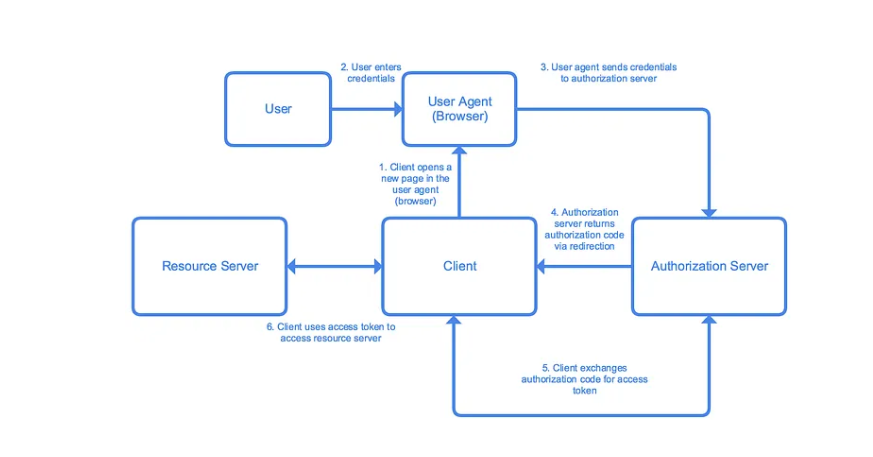
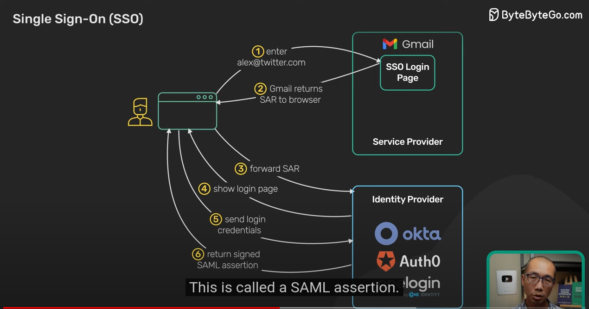
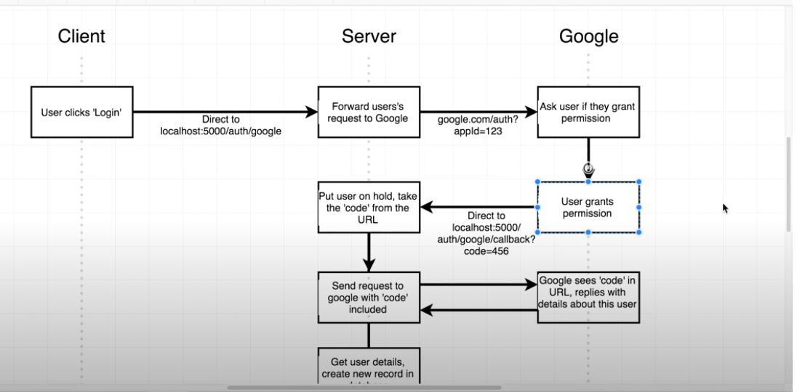
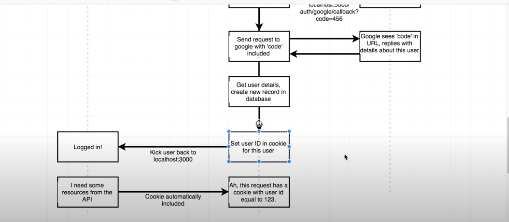

# How do search engines work?

1. Crawler - crawlers constantly crawl the internet for new web pages. They look for urls, then read the content and other urls within the web page to crawl the entire internet.
2. Indexing - one the content is crawled, it is stored in a database and indexed. Indexing helps in retrieval of the webpage. The pages are categorized based on freshness, content, site quality
3. Ranking - Search engines use complex algorithms to rank the pages based on user engagement, page load speed etc.
4. Querying - user's query is analysed and the sites are served from the index based on the input query.

Source: bytebytego newsletter

# How uber uses redis to scale it's internal usage of cache?

## Why create a caching service?
- Each team in uber created their own redis solution hence there were multiple implementations doing the same thing which wasted engineering hours

## Goals for CacheFront
- Reduce the need for vertical and horizontal scalihg
- improve P50 and P99 latency
- Replace custom built solutions and force teams to use 1 centralized solution managed by DocStore team

## Handling Cache reads
- Read rows from cache
- Read missing rows from DB
- Asynchronously update the cache with missing rows

## Cache invalidation
- TTL could be used but TTL takes time for cache refresh and uber wanted a more frequent invalidation strategy. Reducing TTL could cause more cache misses which would not solve the problem
- Uber used FLUX which is their own CDC(change data capture) service. They listened to DB query logs to know which rows are updated and then use that to update the cache, using a pubsub model. Consumer of the db events will refresh the cache when a row is updated.
- This approach makes cache consistent with DB within seconds

## Latency reduction
- Uber used sliding window to measure the availability spikes in a rolling window. If the spikes in the current window is more than the threshold, the request is short circuited and that cache node is made unavailable. This reduces the latency penalty since the request was bound to go to DB anyways due to the cache node going down

source: [Do we need to use different API gateways for PC, mobile and browser separately?](https://blog.bytebytego.com/p/how-uber-uses-integrated-redis-cache?utm_source=post-email-title&publication_id=817132&post_id=142949172&utm_campaign=email-post-title&isFreemail=true&r=lz1jk&triedRedirect=true&utm_medium=email)

## 9 Best Practices for building microsercvices

#### Design For Failure
A distributed system with microservices is going to fail.

You must design the system to tolerate failure at multiple levels such as infrastructure, database, and individual services. Use circuit breakers, bulkheads, or graceful degradation methods to deal with failures.

#### Build Small Services
A microservice should not do multiple things at once.
A good microservice is designed to do one thing well.

#### Use lightweight protocols for communication
Communication is the core of a distributed system.
Microservices must talk to each other using lightweight protocols. Options include REST, gRPC, or message brokers.

#### Implement service discovery
To communicate with each other, microservices need to discover each other over the network.
Implement service discovery using tools such as Consul, Eureka, or Kubernetes Services

#### Data Ownership
In microservices, data should be owned and managed by the individual services.
The goal should be to reduce coupling between services so that they can evolve independently.

#### Use resiliency patterns
Implement specific resiliency patterns to improve the availability of the services.
Examples: retry policies, caching, and rate limiting.

#### Security at all levels
In a microservices-based system, the attack surface is quite large. You must implement security at every level of the service communication path.

#### Centralized logging
Logs are important to finding issues in a system. With multiple services, they become critical.

#### Use containerization techniques
To deploy microservices in an isolated manner, use containerization techniques.

## How Oauth 2.0 works

1. User clicks on login button
2. Client opens a Google(or any other) login dialog in the user agent(browser). In this case Google will be the authorization server
3. User logins in the dialog.
4. The authorization server returns a authorization code which the client can use to obtain the access token
5. The client then verifies its identity and uses the authorization code to obtain the access code.

Note: The access tokens can be of any format but the most common one used in JWT format. Access tokens are usually short lived for security and clients can use refresh tokens to renew the access tokens so that user is logged in without asking the user for credentials again.

Advantages of OAuth:
1. Access tokens avoid extra DB calls because the access token itself contains the user information which can be decrypted.

## How SSO works

SSO or single sign on is a protocol which helps users to access multiple applications without being prompted to enter the password again. This is how it works

1. User tries to access a login, lets say xyz.com(service provider)
2. The xyz.com redirects to SSO login page
3. User enters the login id and password in the SSO page(Identity provider).
4. Identity provider then returns the SAML assertion or JWT response containing information about the user and what user can access with the service provider.
5. The browser forwards the SAML or JWT to the service provider
6. service provider validates the SAML or JWT 
7. Returns the protected resource.

Google SSO

Google SSO

Ref
- https://www.youtube.com/watch?v=O1cRJWYF-g4&ab_channel=ByteByteGo
- https://www.youtube.com/watch?v=ZQY6dZyNVkI&ab_channel=StephenGrider

