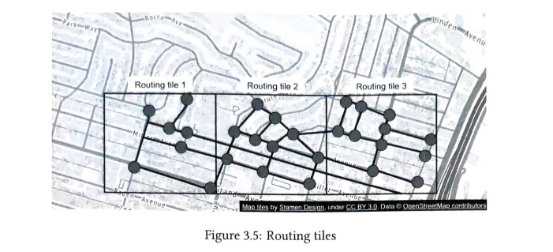
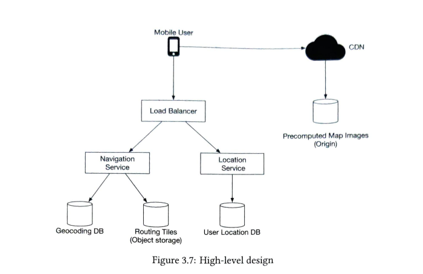
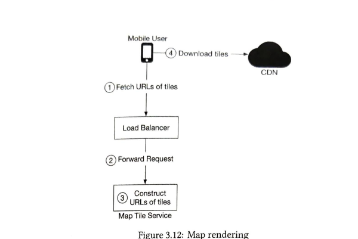
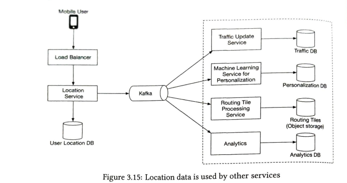
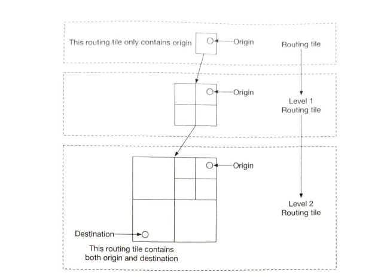
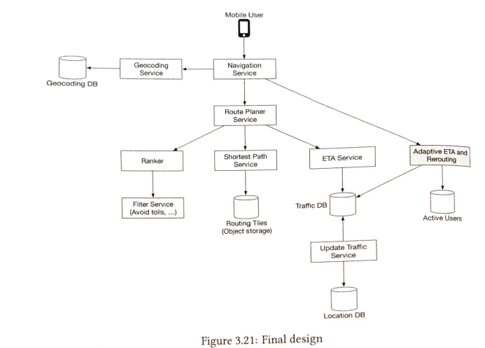

# Google Maps

## Functional Requirements

- User location update: Users update the their location to the server for improving Google maps
- Navigation Service: Navigating to a destination with ETA service
- Map rendering: Rendering map on the device

## Non functional requirements

- Availability: We need high availability
- Smooth navigation: Clients should experience smooth map rendering
- Accuracy: User hould not be given wrong directions
- Data and battery usage: The client should not consume much memory and battery
- Scalability: The design should be scalable

## Map 101

### Going from 3d to 2d

- Map projection is the process of conversion of 3d map to 2d map

### Geocoding

- Process of converions of address to latitude and longitude

### Geohashing

- Process of conversion of a area of land into a string of letters and digit
- The world is divided into smaller grids where each grid is represented in binary
- Binary is then converted into base32 string to represent latitude and longitude in 1 dimention

### Map rendering

- The entire map cannot be loaded in one go because the data would be huge
- Tiling is used where a limited set of grid is loaded based on the client device's viewport
- We store different tiles at different zoom levels. Based on the client device's zoom level, respective tiles are loaded

### Road data processing for navigation algorithms

- Most of the routing algorithms use variation of Dijksta's algorithm
- Routing algorithms operate on graph data structure
- Intersection of roads are nodes and the roads are edges of the graph
- Representing the entire world as graph is too large for any algorithm
- We use tiling and geohashing where the world is divided into grids and small graph data structures are built to represent that grid
- Each graph datastructure hold reference to adjacent grids to stitch together more info if needed

### Hierarchical routing tiles

- We also need tiles at the correct level of detail. For example, when someone is traveling cross country, shopping very detailed road representing each small route would be too complex and would slow down the routing algorithms
- We have three level of tiles
  - First level shows highly detailed local roads
  - Second level shows roads connecting districts
  - Third level shows roads which are major highways
- Each tile can have reference to another tile with a different zoom level to connect highway and local roads, for example


  
## Estimations

### Storage

Road data : TBs of data
Metadata: Metadata for each map tile would be negligible

Map data:

Each tile = 100 KB
total tiles at zoom level 21 = 4.4 trillion
total size = 440 PB
90% of area is ocean
effective area = 50 PB
total area at all zoom levels = 50 + 50/4 + 50/16 .... = 67 PB ~ 100PB

### Server throughput

DAU = 1 billion
each user uses 35 mins of map per week
total week request = 35 billion mins per week = 5 B mins per day
If we send requests every second, then total requests = 5 * 60B / 10^5 = 3 million QPS
lets say we will send it every 15 seconds = 200,000 QPS
Peak QPS = 5 * QPS = 1 million QPS

## High level design



### Location service

- We can send location in batches every 15 seconds.
- At Google Maps scale, the write volume is still very high. We would need to use a write heavy database like Cassandra
- We also would be using Kafka for stream processing of data for various use cases
- HTTP protocol can be used

```text
POST /v1/location
Parameters
locs: {lat, long, timestamp) tuple
```

### Navigation Service

- Navigation service will find a reasonably fast route from source to destination
- Accuracy is critical, we can tolerate a little bit of latency

```text
GET /v1/nav?source=A&desitnation=B

Response:
{
  'distance': 5,
  'duration': 1h,
}
```

### Map rendering logic

- We can pregenerate a set of tiles at various zoom level.
- Each tile is represented by it's geohash.
- The client sends its location and zoom level and based on that we can calculate the tile represented by its geohash
- The tiles are served from CDN
- The client can cache some tiles on the device itself because a user might use a route multiple times. For example, navigating to office everyday will use the same tiles
- How to find which tile to request and make the map url can be done in two ways. First option is to use the latitude, longitude and zoom level to find the geohash and then request the tile using path.com/234df3.png. This would work but the encoding of geohash would be done on different devices running on different platforms. Changing the logic in future would involve updating a large number of devices, which could be a problem. We can create a URL serice for this, whose only job will be to construct the map url and send it back to the client. This will give us more control over the encoding, since we would be owning the server.



## Deep dive

### Data model

#### Routing tiles

Raw data in the form of roads is not usable. This raw data is convered into a set of routing tiles using periodic processing by some pipeline. We create 3 sets containing routing tiles at different levels of detail. How to store these routing tiles? We cannot keep all of them in memory like a normal graph datastructure is represented(adjacency list). One way is to serialize them into binary file and store them as object storage like in S3.
We can also store them in rows in database but that would be overkill since we would only be using the database to store but won't be making use of other DB features
We should also cache the routing tiles heavily in the routing service.

#### User location data

User location data needs to be stored in a database that can handle heavy writes like Cassandra.
We will store the following:

- userId
- timestamp
- user_mode: active/inactive
- driving mode: car
- latitude
- longitude

#### Geocoding database

- This is used to store latitude and longitude of places.
- This needs to be read heavy and writes won't be common
- A good choice would be to use redis to store this data as a key value pair

#### Precomputed images of world map

- These can be cached in CDN
- Backend storage can be S3 or any other object storage

### Services

#### Location Service

- We choose availability over consistency here
- Writes are huge so Casssandra would be a good choice
- We will store the primary key as user_id and timestamp as clustering key. Value would be latitude, longitude pair
- making partition key as user_id means that all location of a user would be stored in a single partition and thus retrieval of locations of a particular user would be efficient
- How will the location data be used
  - We will save user location in location DB for future use.
  - We will also publish the location data to kafka where multiple services can subscribe to this data
  - Machine learning service can use machine learning for personalization
  - Routing tile service can use this data to detect blocked roads and other such updates to routing tiles and update the object storage with the updated tiles
  - Traffic service can find out the live traffic status and update the live traffic db

  

#### Rendering map

- We create different tiles at different zoom levels
- Based on the zoom level and the position of the user, tiles are loaded
- This way we can load only the required tiles to save bandwidth
- Vectorized images can also be used which can be compressed more efficiently hence saving network bandwidth

#### Shortest path service

- Shortest path service is responsible for finding the distance between the source and destination. It returns the top k shortest paths.
- The alogithm used can be variation of Dijkstra's algorithm
- The service receives the starting and ending point location
- These points are converted into geohashes to load the routing tiles
- The algorithm starts from the starting point routing tile and as it slowly hydrates neighboring tiles which are required
- There are connections from one level of tile to another so that we can enter the bigger tiles containing only the highways

#### ETA service

- The ETA service takes the possible paths as input and finds the time taken on each path, and then returns the estimated time taken for each paths
- ETA service uses machine learning to find the path with least time taken and this is done using the live traffic data
- One point to note here is that the traffic data after 10 - 20 mins should also be considered since the traffic might change

#### Ranker service

- Once the estimated time is calculated, this information is passed to the route planner and it then passes this information along with user filters to the ranker service
- The ranker service takes all the k paths, with ETAs, with filters (like avoid tolls etc) and ranks the paths based on time taken, from lowest to highest and returns the result to the navigation service

#### Updater service

- Traffic service: This service takes the location data and updates the live traffic DB which is used by ETA service to give accurate results
- Routing tile processing service: This service takes the location data to see which roads are closed and which roads are newly constructed and updates the routing tiles. The updated routing tiles will help shortest path service to give accurate results

### Improvement - Adaptive ETA and rerouting

- Our current design doesn't take into account the changing traffic and how it will impact the ETA.
- To do this we can create a database which tracks the routing tiles used by each user to navigate

```
user1: r1, r2, r3, r4, r5, r6
user2: r2, r3, r4, r5
.
.
usern: r1, r2, ... rm
```

- Now let us say that routing tile r2 has some issue and the road is blocked. To find out which active users are effected, we can use brute force solution to iterate and find each user which has r2 tile.
- Another approach is to go up a level and find the routing tile which contains the current tile and keep doing this until the destination also falls under the routing tile: r2, super(r2), super(superIr2) ....
- Now, we need to check if the affected routing tile r2 is in ths file tile or not for all active users. If yes, those users' ETA would be updated.



### Delivery protocols

- The server needs to constantly send updates for rerouting etc. So Websocket would be a better solution because it is light weight as compared to long polling.
- Websocket is light weight because it doesn't need to open and tear connections like long polling. Also, not every HTTP header is sent in all websocket requests.

### Final design



## TODO

- Study rasterized images and vectorized images and how vectorization helps save network bandwidth and zoom level smoothing
- Go through all the reference links