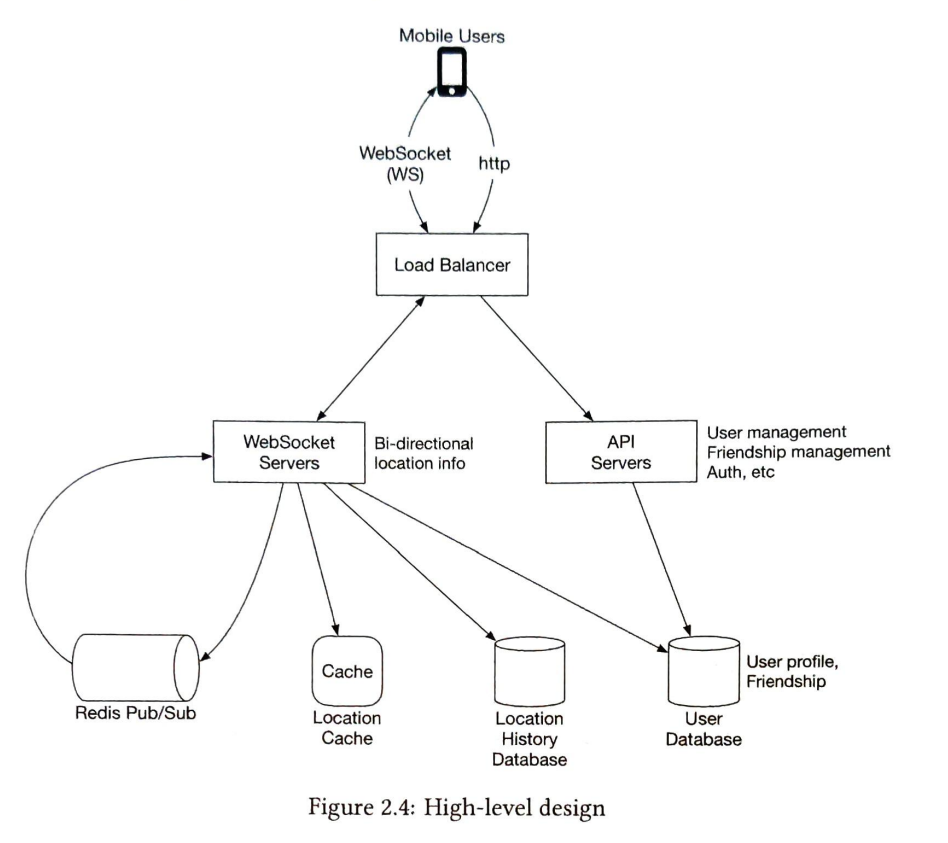
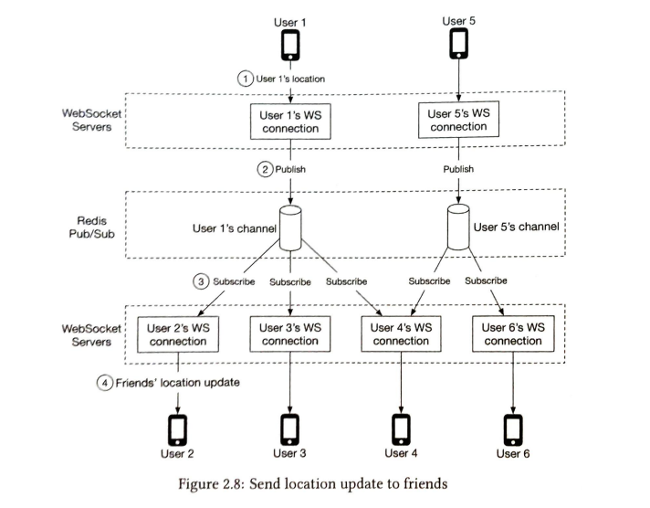
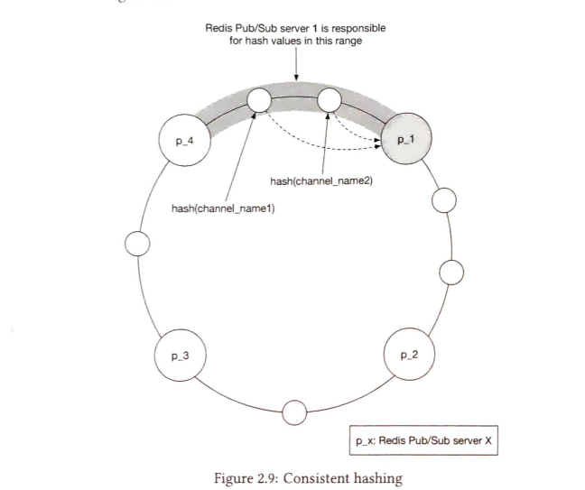
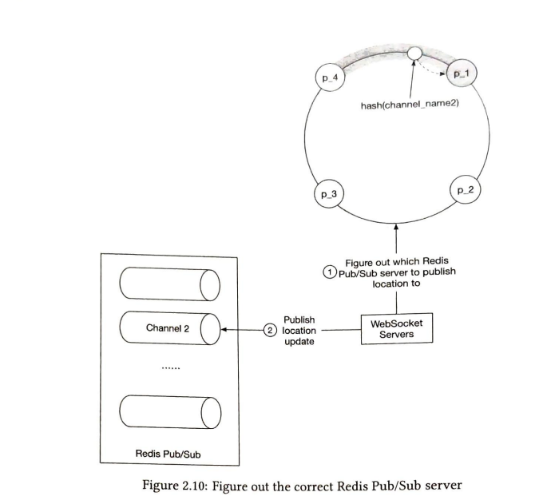
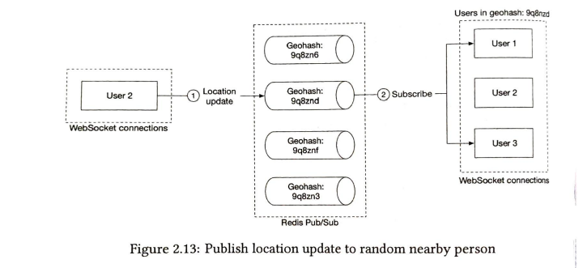

# Introduction

This is similar to a feature on the facebook app where you can see which friends are nearby, if the users give location permissions to the app. Some points to note:

- Assume 1 billion users with 10% users who use this feature
- No need to consider GDPR and other compliance related stuff
- 10 km or near can be considered "nearby" and this radius can be changed
- distance is measured in straight line
- Location history should be stored for ML
- If a friend is inactive for more than 10 mins, they should not be shown on the app

## Functional Requirements

- Users should be able to see nearby friends. Each entry should have the distance and timestamp indicating the last time the distance was updated.
- The list should be updated every few seconds.

## Non functional requirements

- Low latency: Receive location updates from friends without much delay.
- Reliability: Occasional data point loss is acceptable, but system should be reliable overall
- Eventual consistency: Few second delay in receiving location update in replicas should be acceptable with eventual consistency

## Estimation

Total users of nearby friends = 100 million
DAU = 10% of 100 million = 10 million
Users report location every 30 seconds
QPS = 10,000,000/30 = 334,000

## High Level Design

In theory, we can use p2p connections where each phone connects to other phones in vicinity.  This will not work practically:

1. Mobile connects are flaky
2. Battery consumption will be huge because each phone will maintain multiple connections

Therefore, websocket connection is the best protocol to use here.

### Proposed Design

#### Load balancer

- Separates out the requests for web socket servers and api servers
- spreads out the traffic evenly

#### RESTful API Server

These servers are stateless servers which handle requests like add/delete friends, profile update etc.

#### Web Socket Servers

These are stateful servers that the clients connect to and send location updates. 
The clients also receive location updates from nearby friends through these servers.

#### Redis location Cache

A cache is maintained with the friend_id and location to keep track of the latest location update. The cache has a TTL which represents if the user is active or not.

- When TTL expires, it means that the location has not been updated for a long time and the user is not active
- When cache is updated with new location, TTL is also updated.

#### User database

SQL database to store user info

#### Location history database

Database to store location history of user for machine learning usecases.

#### Redis Pub/Sub server

Redis pub/sub is light weight and a modern server could hold millions of channels
These are used to send location updates to friends. The friends are subscribers who receive the location when there is update by the current user.

#### How location update happens?

1. The phone sends location update to the load balancer
2. load balancer forwards the location update to persistent connection on a websocker server for that client
3. websocket server saves the location data to the location history database
4. websocket server updates the latest location in the location cache. TTL is refreshed. the location is also saved in a variable in websocker connection handler for distance calculations
5. the webcoker server publishes the new location to the user's topic/channel
6. the location update is broadcasted to all the subscribers to the user's topic
7. the friend's websocket connection handler would receive the location of the user
8. on receiving the location, the websocker connection handler calculates the distance using the variable which has the the location for the friend and the location received from the subscriber.
9. if distance is close, the new location and timestamp is passed to the subscriber's client.

### API Design

#### Web socket

Periodic location update:
Request: location, timestamp
Response: nothing

Client receives location update:
Data sent: location, timestamp

Websocket initialization:
Request: location, timestmap
Response: friend's location data

Subscribe to a new friend:
Request: WS sends Friend Id
Response: location,timestamp

Unsubscribe to a friend:
Request: WS sends friend ID
Response: nothing

#### HTTP Requests
add/delete friends, update profile etc.

### Data model

#### Location cache

Redis is used for location cache. We store the following data:
key: user_id
value: location, timestamp

We choose Redis and not some database because:
1. Do don't need durable storage here because even if the cache goes down, it can be started with an empty cache which can warm up over time. It is a reasonable tradeoff.
2. Redis gives super fast read wrtie speeds.

The cache will have TTL per entry which will be updated as the data is updated. As soon as the TTL expires, the data is removed from the cache which means that the user is inactive.

#### Location History database

- We need database here since we need to persist the data for machine learning.
- Since the write is heavy, Cassandra can be used. 
- We can also use Relational database but sharding would be required on user_id

### Design Deep Dive

#### How will each component scale?

##### API server

These are stateless and can scaled by adding more servers or autoscaling them by increasing CPU or memory.

##### Websocket servers

Websocket connections are stateful and scaling them is complex. We first need to drain the traffic from the servers from the load balancer side before adding a new server which has more hardware resources. 

##### Client initialization

The clients will need lond running connections to websocker servers because they constantly need to update the location and receives update(bidirectional flow). 
When the connection is initialized, the client sends location of the user. Websocket handler does the following:

1. It updates the user's location in the location cache.
2. Saves the location in a variable for further calculations
3. Loads the users friend's from the database.
4. Sends batch request to fetch location of all the friends from the location cache
5. for each location returned from cache, the distance is calculated with the user's location. Far friends are ignored.
6. The final result is returned back to the client.
7. For each friend, the server subscriber to friends topic. This is done for both active and inactive friends.

##### User database

- The user database will hold the user data like profile, friends etc.
- We can use relational database with sharding on user_id to scale the database

##### Location Cache

  - Redis cache is used to store user_id and location
  - There are 10 million active users with each entry requiring 100 bytes, it can fit in one server.
  - But 10 million users sending request every 30 seconds means that QPS on redis server will be 334K, which is high. We can shard the data based on user_id and share the load among many redis servers.
  - To improve availability, we can replicate the location data on each shard in a master-slave replication architecture.

#### Redis Pub/sub server

Redis Pub/sub server is chosen because it is lightweight

1. We assigne a unique channel for every user who uses nearby friends feature. During the initialization, each user subscribes to all the friends whether active or inactive. This won't consume much memory but would simplify the design by a lot, hence it is a valid tradeoff.

#### How many Pub/sub servers will we need

Memory usage

Assume a channel is created for each user, we would need 100 million channels. each channel would need 20 bytes of storage, so total memory needed will be 200 GB. We can have 2 redis servers.

CPU usage

Pub/sub servers push 14 million updates per second to subscribers. Let's say each server is capable of handling 100,000 updates per second. Total servers = 14,000,000/100,000 = 140 redis servers

Hence we would need a redis cluster.

#### Distributed Redis cluster

Since we have a cluster of 140 redis servers, we would need a service discovery component which makes it easy for us to distribute the channels among these servers. We can use zookeeper or etcd for this.

We can use the concept of consistent hashing and hash ring here. 

We need the following:
1. Ability to keep servers in a service discovery component and an API to update it.
2. Clients to subscribe to updates to the hash ring

1. We can create a hash ring which maps different redis servers on the ring. When the web socket handler sends the request to connect to a channel and publish data, the channel_id is hashed and mapped onto the ring to find the correct redis server which hosts that channel.
2. Although zookeeper holds the hash ring and is the source of truth, we can keep a copy of hash ring in memory in each WS server. This can be kept updated regularly to keep it consistent.

#### Scaling Redis cluster 

- The Redis servers are stateful because each channel has certain set of specific subscribers. Whenever a redis server is turned down or replaced, we need to move the subscribers for that channel to new channel in a new server.
-   Whenever there is a change of redis server, the zookeeper will send updates to the web socket servers  hence there will be a lot of resubscription requests
-   Some ocassional misses in location update will be there which should be acceptable tradeoff.
-   Resizing should be done during the lowest traffic point of the day to avoid updates misses.

Whenever a new server is added to the hashring:
1. The traffic monitor sends updates about the changes in channels to the WS server.
2. Only a small segment of hash ring will be updated.

The channel updates are received on the WS server handler and the handler has list of channels it has subscribed to. It checks each channel to see which channels need to be resubscribed.

#### Add/remove friends

Whenever the main app has added/ removed friends, we can have callbacks to the Web socker servers which will do the following:
1. In case a new friend is added, the WS server subscribers to the new friends channel
2. The new channel also sends the new friends location if they are online
3. When a friend is removed, another callback removes the subscriber from the channel

#### Users with many friends

- The subscribers are scattered across many WS servers so the traffic is distributed and there should be not hotspot.
- The load would increase on the pub/sub server. But since the servers are placed in a hash ring and there are 100 of them, the traffic should be ditributed evenly.

### Nearby random friends

As an additional feature, if we want to find nearby random friends. We can create pub/sub servers where we create a channel for a geohash. All the users who opt for nearby random friends should publish their location on this channel as well as subscribe to the geohash channel based on their location. 
The location updates from that geohash channel would be sent to the users  who subscribe.

## TODO
1. How to scale stateful servers behind a load balancer
2. Zookeeper and service discovery and how it is used with hash ring

