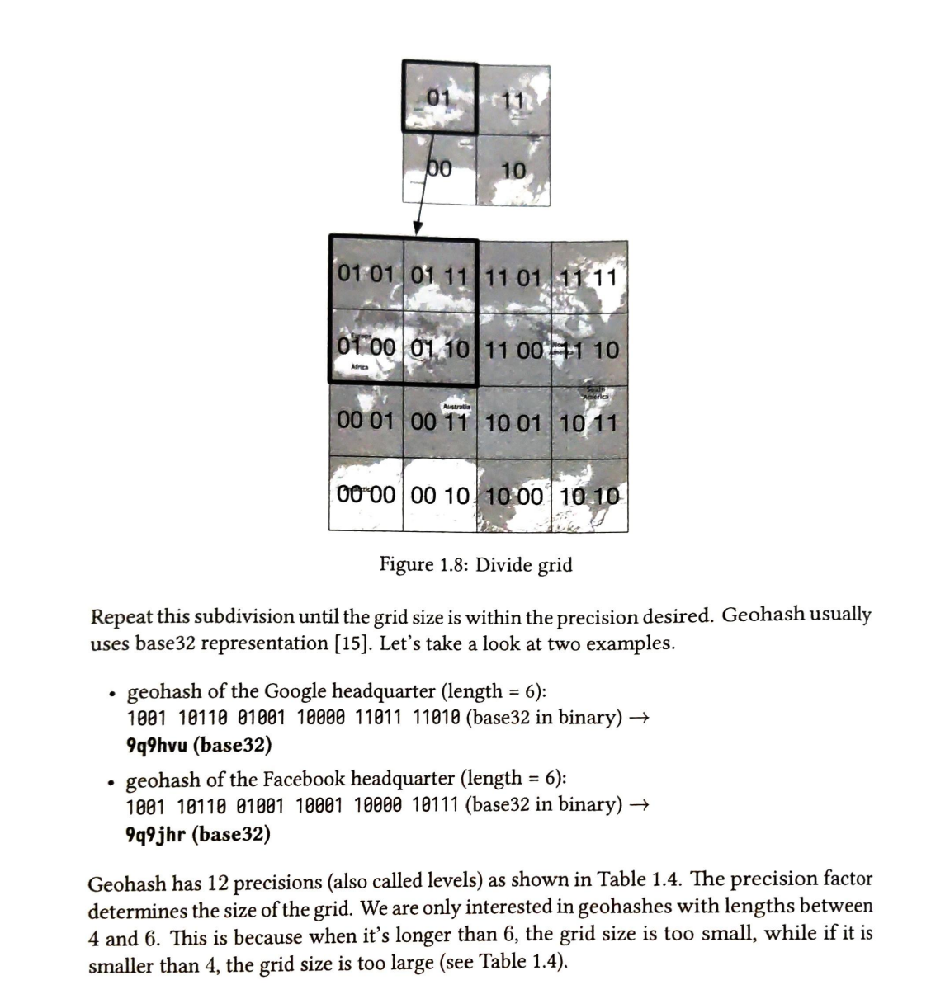
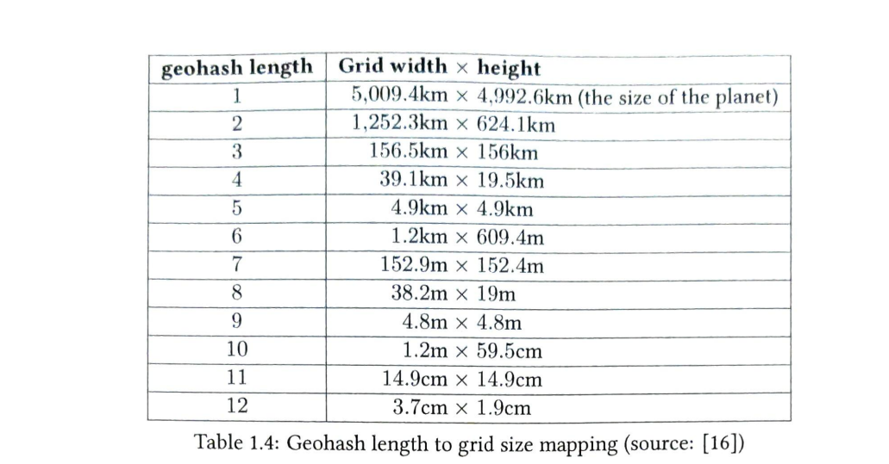
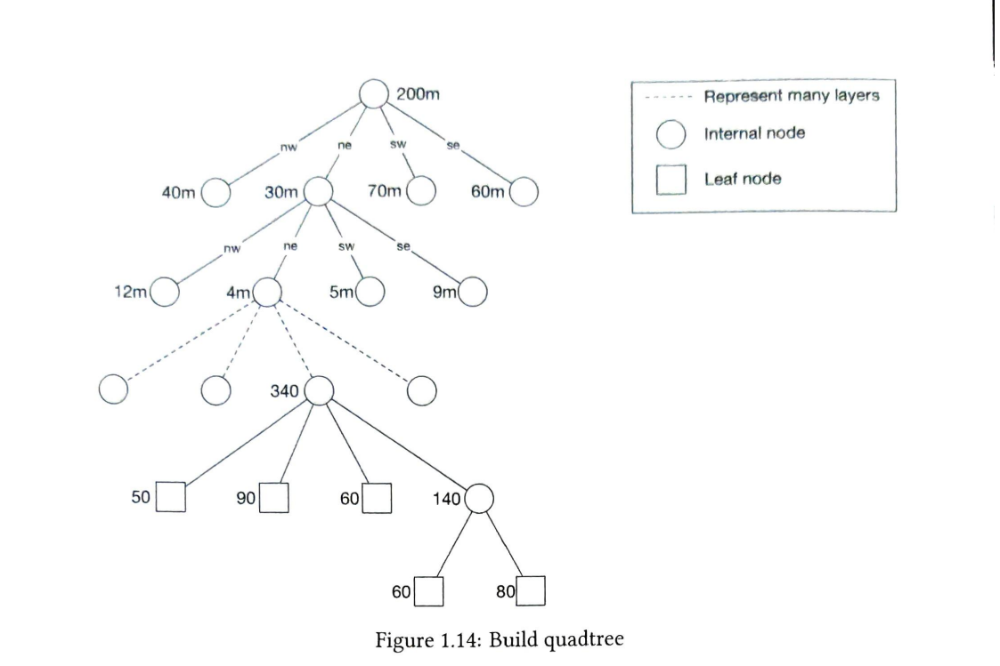
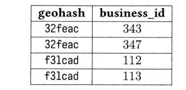

# Proximity Service

This service is useful to discover nearby points from the user and is a major component for the following products:

1. Google maps to find the nearby ATMs, petrol stations etc.
2. Yelp to find the nearby restaurants.

## Functional Requirements

1. The user should be able to search within a specific radius. If there aren't enough businesses within that radius, the search radius should expand. The user can change the search radius on the UI.
2. Business owners can add, delete and update business information. The information should be updated within the SLO.
3. Customers can view detailed information about a business.

## Non-functional Requirements

1. Low latency: users should be able to search for locations quickly.
2. High Availability: System should be able to handle spikes in traffic
3. High scalability
4. Data privacy: Location data is sensitive and we should take care of compliance while storing this data.

## Estimations

DAU = 100,000,000 (assumption)
Businesses: 200,000,000 (assumption)
Total seconds in a day = 10,000 (approx)
total queries by a user in a day = 5 (assumption)
QPS = 5 * 100,000,000 / 100,000 = 5000

## API Design

**GET /v1/search/nearby**: This endpoint returns paginated results giving details for businesses

Request parameters:

- latitude
- longitude
- radius

This API will return everything needed to display the search results, but we need separate API to display business related information when a user clicks on a particular business

**GET v1/businesses/:id**: return info about business

**POST v1/businesses**: add business

**PUT v1/businesses/:id**: update business info

**DELETE v1/businesses/:id**: delete business

## Data Model

This will be a read heavy system:

1. Large # of requests for search
2. large # of request for viewing business info

For read heavy system, relational DBs are a good fit(why?).

## Data schema

### Business Table

- business_id PK
- address
- city
- state
- country
- latitude
- longitude

### Geo index table

This table is used for efficient processing of spatial operations.

## High Level Design

See the diagram below:

### Load balancer

Distributes incoming traffic among different services. We will provide a single entry point and redirect the request to the correct service internally using URL paths.

### Location Based Service

- It is ready heavy with no write requests.
- It is stateless
- QPS is high

### Business service

- write requests are add, delete and update business. These are not write heavy.
- Customers can view detailed info about a business. QPS is high during peak hours.

### Database cluster

- We can use primary secondary setup.
- Primary database handles the write requests and multiple replicas are used for read requests
- Data is first saved to primary database and then replicated across replicas.
- Replication delay is not a problem since real-time update is not required. We can update the info within the SLO.

### Scalability

highly scalable because both services are stateless hence it is easy to scale by just adding more servers

## Algorithms to fetch nearby businesses

### Two dimensional search

What if we store the latitude and longitude of the businesses in database tables and return all the businesses within a specific radius from the user?
This approach won't work because the query would need to scan the entire table to figure out what businesses would fall in the circle around the user.
Even if we index the database on latitude and longitude, we would only be improving search in one dimension. We would have to intersect the data which would be huge, hence it won't be efficient.

### Evenly divided grid

This approach divides the world in small grids of equal size. The problem with this approach is that the population density is not uniform so some grids might have a lot of datapoints while others maybe sparse.

### GeoHash

The idea behind GeoHash is to reduce the two dimensional latitude and longitude into a one-dimensional string of letters and digits.
Geohash works by diving the work into smaller and smaller grids with each additional grid.

See the image below:

Geohash has 12 precisions which map to the grid size:

#### Caveats

Geohash guarantees that the longer the prefix between two locations, the closer they are. But the reverse is not true. For example, two points closer to the boundary between two grids might be close to each other but their prefixes might not be equal.

A common solution is to also fetch all businesses from the neighbouring geohashes as well.

#### What if there aren't enough businesses in the geohash?

We can increase the search radius by removing a bit from the last of a geohash. We can keep doing this until there are enough businesses.

### Quad Tree

Quad tree is a data structure that divides the world into smaller grids. The root is the world and each node has 4 children representing a single grid. The tree keeps growing until some condition like number of businesses in a single node is met.

#### Memory taken by Quad Tree

Quad tree shouldn't take more than 2 GB of memory so it should fit in 1 server. But still we cannot use 1 single server because a single quad tree might not have enough cpu or network bandwidth to serve all read requests.

#### Time taken to build a Quad Tree

time complexity is around nLogn. n = total number of data points.
It might take few minutes to build quad tree.

#### How to get the businesses

- Search from the top until you get to a leaf node which has search cordinates.
- If the node has 100 business return
- Else add businesses from neighboring nodes.

#### Important points

-  We need to take care of deployment strategies since quad tree takes sometime to built hence server startup time can be minutes.
    - Blue Green Deployment: Two identical environments are maintained and new version is release to one environment. After testing, traffic is switched over.
    - Canary deployment: The new release is deployed to a small set of servers or regions and then expanded to more servers.
    - Other techniques like Shadow deployments, rolling deployments can also be used.

- Another problem is how to update the quad tree. We can update the quad tree incrementally taking small set of servers at a time. We can also do nightly update since businesses would have agreements of around 2 days. This might cause a huge load on cache servers since a lot of keys would be invalidated after nightly update.

#### Google S2

This is Google libary which converts a sphere representation into 1d. It has important point that two points that are close to each other in 3d space are also close in 1d space.
Google S2 offers much more granular control as it can do geofencing and returning much more granular functionalities like growing the search area arbritarily.

#### Which to choose?

Choose either geohash or Quadtree

Geohash
- Easy to use and implement
- supports returning businesses within a specific radius
- Cannot typically support population density
- Updating index is easy

Quadtree
- slightly hard to implement
- Supports fetching k nearest businesses which could be useful in case the user wants to know the nearest petrol pumps, no matter the distance. We can do this using by modifying the subdivision statement during tree construction.
- dynamically adjust the grid size based on population density
- updating index is hard.

## Design Deep Dive

### Scaling

- Business table : Business table can be huge so sharding would be needed. We can shard using business_id.
- Geospatial index table: We will use geohash here. We do not need sharding here since data it not that much (in GBs). We can use many read replicas which will help distribute the read request and balance the load.

## TODO

1. How to decide on sharding is needed or not based on estimations.
2. How to design paginated APIs
3. General API design best practices including request parameters :var type in path
4. Type of DB for read and write heavy systems and why
5. how geo spatial index works
6. How geohash works
