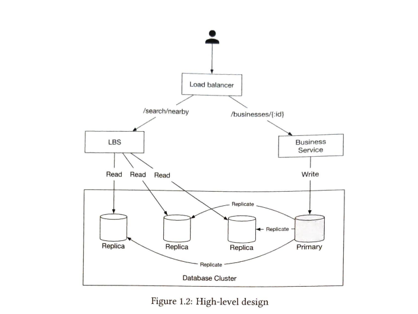

# Proximity Service

This service is useful to discover nearby points from the user and is a major component for the following products:

1. Google maps to find the nearby ATMs, petrol stations etc.
2. Yelp to find the nearby restaurants.

## Functional Requirements

1. The user should be able to search within a specific radius. If there aren't enough businesses within that radius, the search radius should expand. The user can change the search radius on the UI.
2. Business owners can add, delete and update business information. The information should be updated within the SLO.
3. Customers can view detailed information about a business.

## Non-functional Requirements

1. Low latency: users should be able to search for locations quickly.
2. High Availability: System should be able to handle spikes in traffic
3. High scalability
4. Data privacy: Location data is sensitive and we should take care of compliance while storing this data.

## Estimations

DAU = 100,000,000 (assumption)
Businesses: 200,000,000 (assumption)
Total seconds in a day = 10,000 (approx)
total queries by a user in a day = 5 (assumption)
QPS = 5 * 100,000,000 / 100,000 = 5000

## API Design

**GET /v1/search/nearby**: This endpoint returns paginated results giving details for businesses

Request parameters:

- latitude
- longitude
- radius

This API will return everything needed to display the search results, but we need separate API to display business related information when a user clicks on a particular business

**GET v1/businesses/:id**: return info about business

**POST v1/businesses**: add business

**PUT v1/businesses/:id**: update business info

**DELETE v1/businesses/:id**: delete business

## Data Model

This will be a read heavy system:

1. Large # of requests for search
2. large # of request for viewing business info

For read heavy system, relational DBs are a good fit(why?).

## Data schema

### Business Table

- business_id PK
- address
- city
- state
- country
- latitude
- longitude

### Geo index table

This table is used for efficient processing of spatial operations. 

## High Level Design

See the diagram below:

### Load balancer

Distributes incoming traffic among different services. We will provide a single entry point and redirect the request to the correct service internally using URL paths.

### Location Based Service

- It is ready heavy with no write requests.
- It is stateless 
- QPS is high

### Business service

- write requests are add, delete and update business. These are not write heavy.
- Customers can view detailed info about a business. QPS is high during peak hours.

### Database cluster

- We can use primary secondary setup.
- Primary database handles the write requests and multiple replicas are used for read requests
- Data is first saved to primary database and then replicated across replicas.
- Replication delay is not a problem since real-time update is not required. We can update the info within the SLO.

### Scalability

- highly scalable because both services are stateless hence it is easy to scale by just adding more servers

## TODO

1. How to decide on sharding is needed or not based on estimations.
2. How to design paginated APIs
3. General API design best practices including request parameters :var type in path
4. Type of DB for read and write heavy systems and why
