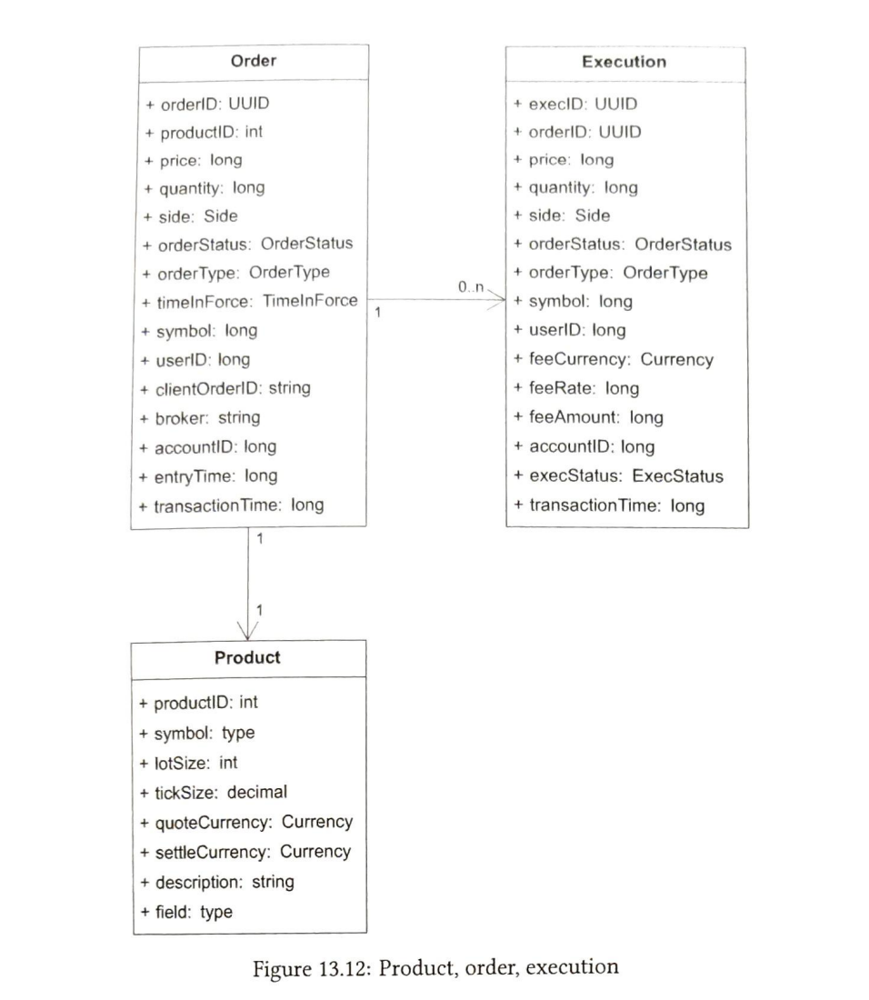

# Stock Exchange System

## Functional Requirements

1. The ability to buy and sell stocks during trading hours only.
2. Wallet management - Witholding of stocks when the order is pending, enough balance in the wallet to execute trades
3. Risk checks - A user should not be able to place more than 1 million orders per share per day.
4. Trading should be performed for atleast 100 stocks.

## Non-functional Requirements
Non functional requirements hsould be based on the following:
1. Support for alteast 100 symbols
2. Support 1 billion trades per day

1. Availability: Atleast 4 nines of availability: 99.99%. This is because down time is costly for exchanges
2. Fault tolerance: Fault tolerance is needed for fast recovery to limit the impact of an incident.
3. latency: Should be millisecond level. We should try to lower the 99 percentile latency. This is because if this number is high, it will be a bad user experience. Latency is measured from the time order is placed by the order to the time the order is filled and reported back to the user.
4. Security:
    a. KYC of customers
    b. Prevention of DDoS attack on public facing web pages like price graphs etc.

## Back-of-envelope Calculations

1. 1 billion orders per day: 1,000,000,000
2. Stock market operation hours: 6.5 hour per weekday
3. Total time in seconds: 6.5 * 3600
4. QPS = 1,000,000,000/(6.5 * 3600) = 43,000

Peak QPS = 5 * QPS = 215,000

## High Level Design

Some business knowledge:

1. Most users trade on stock exchange via brokers. These brokers provide a user friendly interface.
2. Institutional clients are the once who trade in big volumes. They need special software to do it. For example, hedge funds need softwares which support very low latency as compared to normal users.
3. Limit order is a buy or sell order with a fixed price. When price matches, it gets executed.
4. Market order: It excecutes at market value of the price, immediately.
5. FIX protocol: This protocol is used for trading information transfer over the network


**Add diagram here**

There are three flows:
1. Critical path: Placing orders
2. Reporting flow: Reports the data and persists it in database
3. Market data flow: Collects the orders and executions and publishes it to the market


### Critical Path or Trading flow

1. User places the order from the broker
2. The broker send the order to stock exchange's component gateway.
3. Component gateway does basic validations, rate limiting, authentication. It then forwards the order to order manager
4. Order manager performs risk checks as set by the exchange
5. After successful risk checks, order manager checks that there are sufficient funds in wallet.
6. After that order is sent to the matching engine, where it matches the similar sell request, it generates two orders one for buy and one for sell.
7. The executions are sent back to the client

### Market data flow
1. The matching engine publishes a stream of executions to the market data publisher.
2. Market data publisher creates order books and charts.
3. It then sends the market data to the data service.
4. Data service stores the data in specialized storage for real-time analytics. Brokers connect to the data service.
5. Brokers relay the data back to the clients.

## Reporting flow
1. Collects the data like order number, client_id etc. and persists into the database.

## Matching Engine
Matching engine performs the following functions:
1. Mathcing of buy and sell orders. Matching function must be fast and accurate
2. Send market data to market data publisher
3. Construction of order book.

The Matching engine must be highly available and deterministic. That is, the same sequence of orders must produce the same executions.

## Sequencer
This is what makes the matching engine deterministic.
1. Sequencer has two instances: inbound sequencer and outbound sequencer.
2. Inbound sequencer adds squence ids to each order coming and then sends it to the matching engine.
3. Outbound sequence adds sequence ids to each execution and sends it back to the order manager.
4. This is done to detect any missing orders/executions.
5. Matching engine is connected to these two sequencers, one is used for receiving orders and other for publishing executions backt to order manager.
6. Sequencer also acts like a messaging queue. Kafka could be used but its latency is very low and  is not predictable.

## Order manager
1. Order manager manages an order's state.
2. It also executes the risk checks
3. It verifies the rorders against the wallets funds.
4. It sends the orders to the seqencer and receives the executions from the matchign engine through the sequencer.
5. Some non essential attributes are removed from the order before sending it to the matching engine.

## Client gateway
1. Client gateway does authentication, rate limiting, validations etc. 
2. There will be different client gateways for different type of users. Intitutional clients will have very low latency client gateway.
3. Client gateway lies on the critical path so it should be low latency. It is a tradeoff to decide what to include in the client gateway and what to leave.
4. Colocation engine is a trading software running inside the exchange data center, which is the lowest latency possible. Brokers/dealers use these colocation engines. 

## Market data publisher

1. The market data publiser creates the order books and the candlestick charts from the executions received.
2. This data is sent to the data service to which the clients subscribe to get the data.

## Reporting

1. Provide auditing, history, tax reporting, compliance etc.


## API Design

The following APIs would be needed:

- POST /v1/order
    - Parameters: symbol, side, quantity, price
    - Response: id, creationTime, filledqty, remqty, status.
- GET /v1/execution?symbol={:symbol}&orderId={:orderId}&startTime={:startTime}&endTime={:endTime}
    - Parameters: symbol, orderId, startTime, endTime
    - Response: Array of executions(id, orderId, symbol, quanty, price, type, side)
- GET /v1/orderbook/symbol={:symbol}&depth={:depth}
    - Response: bids and asks
- GET /v1/candles?symbols={:symbols}&startTime={:startTIme}&endTime={:endTime}

## Data modoels

Three main types of data:
- Product, order and execution
- Order book
- Candlestick chart

### Product 

Product is the actual stock. For example, HDFC is one product. It can have the following attributes:
1. Symbol
2. Name
3. description
4. lotSize
5. productId

### Order

Order is an instruction to buy or sell a stock at the best available price. It ensures that the stock buy/sell will be executed but doesn't gaurantee a specific price. An order can have the following attributes

1. orderId
2. productId
3. price
4. quantity
5. status
6. type
7. userId
8. transactionTime

### Execution 

Execution of an order is the actual fulfillment of the order placed by the client. It can have the following attributes:
1. execId
2. orderId
3. price
4. quantity
5. type
6. status
7. userId
8. transactionTime



Points:
1. Orders and execution int the critical path are not stored in DB in order to achieve high performance. Trades are executed in memory. Orders and exections are archived to disk after the day closes.
2. Reporter writes orders and executions to DB for reporting.

### Orderbook

How orders are executed? Watch this: https://www.youtube.com/watch?v=Kl4-VJ2K8Ik
> Note: Exchange  tries to give the best price to the customer. It means if the customer is buying at the market, it will try to give the cheapest price possible. If the customer is selling, it will give the max price possible from the trades in order book.

Notes:
1. Buys are sorted in decreasing order because when you sell you want the highest price
2. Sells are sorted in increasing order because when you buy you want the lowest price

An efficient data structure for order book must satisfy:
1. constant lookup time: We would need to find out how many shares are available at a particular price level.
2. Fast add/cancel/execute operations at O(1).
3. Query best BID/ASK.
4. Iterate through price levels.

The following data structure would work well:

```java
class PriceLevel {
    private Price limitPrice;
    private long volume;
    private List<Order> orders; // Doubly linked list
}
class Book<Side> {
    private Side side;
    private Map<Price, PriceLevel> limitMap;
}
class OrderBook {
    private Book<Sell> sellBook;
    private Book<Buy> buyBook;
    private Map<OrderId, Order> orderMap;
}
```
- Adding new order means adding the order to the tail of doubly linked list which is O(1)
- Deleting new order means deleting order from head of the list which is O(1);
- Cancelling order means we will take the pointer value form orderMap against the orderID and use that to delete it from the respective doubly  linked list.

### Candlestick

```java
class CandleStick {
    private long openPrice;
    private long closePrice;
    private long lowPrice;
    private long highPrice;
    private long volume;
    private long timestamp;
    private int interval;
}

class CandlestickChart {
    private LinkedList<Candlestick> sticks;
}
```
## Step 3 Design Deep Dive

### Performance
- Latency should be very low for stock exchange.
- Latency is measured in 99th percentile.
- Latency can be reduced along the critical path in two ways:
    - Reduce the number of tasks in critical path
    - Reduce the time taken by each task in critical path

Reducing the number of tasks in critical path: We will only have the essential components needed for a trade to execute:
- gateway
- order manager
- sequencer
- matching engine

Reducing the time taken by each component in critical path:
- Network request/response for all compoents would take single digit millisecond latency.
- Disk IO by sequencer would take tens of milliseconds of latency.
- This number is high for low latency trading systems.
- Exchanges want to achieve latency in order of tens of microseconds by removing network and disk IO as much as possible.
- This can be done by putting all the components on 1 server. This enables all the components to talk via mmap as as event store.
- Each component runs as the process on the single server.
- Tasks are executed by the application loop which polls for tasks in a while loop.
- Each application loop is single threaded and pinned to the CPU core
    - Pinning means no context switch as the CPU is always available.
    - No lock contention since there is only 1 thread that updates the states.
- mmap is a way for processes to share memory in performant manner, it helps avoid disk access and brings it down to 0. mmap acts like a messaging bus.


### Event Sourcing

Event sourcin is a way to manage states of an application such that it allows us to regenerate the same output if we replay the states. In this approach, we store an immutable log of events in order of the timestamp in which they executed along with the event status.

Sequencer is the component that reads the newOrderEvent from the ring buffer(which gets it from the gateway) and adds a sequence number to it and forwards it to the mmap/eventStore.
We can have secondary sequencers as well for high availability.

### High availability

- We would need atleast 4 nines of availability.
- We identify single points of failure and fix them. For example, we can have a passive matching engine.
- Detection of failure and fail over to the backup instance should be fast.
- Stateless services like gateway can be scaled horizontally by adding more services and hence reduce single points of failure.
- Stateful services like matching engine would need the ability to copy states across replicas.
- We can have the primary hot matching engine which consumes new events and sends output to the eventStore. We can have a secondary warm matching engine which consumes the exact same events as primary but doesn't send any output. When primary goes down, secondary can replace it immediately.
- Since all of the components run inside a single server, we would need to create warm servers by replicating events across servers and machines. This is because in case the entire primary hot server goes down, we would need the warm server up quickly.

### Fault Tolerance

Let's answer some questions:

Q. There might be false alarms resulting in unnecessary failovers. Also, there might be bug in the code which will bring down backup instance as well if we fail over to it. How to tackle this?

A. We first need to perform failovers manually when releasing a new system. Failover should also be part of integration test pipeline and only when failover is successful we should push the new code to prod. We can also use Chaos engineering.

Q. How to decide which server to take over?
A. We can choose any leader election algorithm. Raft is one such algorithm.

Q. What about RTO and RPO?
A. RTO stands for recovery time object which is the time a system can be down until significant harm is done to the business
RPO stands for recovery point object which stands for the amount of data that can be lost until significant damage is done to the system.

For RTO, we would need automatic failover. For RPO, we would need to maintain multiple copies of data because RPO needs to be near zero for stock exchange. Raft will make sure that state consensus is reached and when 1 leader is down the other leader should be able to function immediately.

### Matching Algorithm

The algorithm used is FIFO matching algorithm. The order which comes fist is fulfilled first.

```java

Context handleOrder(Orderbook orderBook, OrderEvent orderEvent) {
    Order order = createOrderFromEvent(orderEvent);
    switch (msgType):
    case NEW:
        return handleNew(orderBook, order);
    case CANCEL:
        return handleCancel(orderBook, order);
    default:
        return ERROR;
}

Context handleNew(OrderBook orderBook, Order order) {
    if (order.side.equals(BUY)) {
        return match(orderBook.sellBook, order);
    } else {
        return match(orderBook.buyBook, order);
    }
}

Context match(Book<Side> sellBook, Order order) {
    List<Order> marketOrders = sellOrders.limitMap.get(order.price).orders;
    Iterator<Order> orderIter = getIterator(marketOrders);
    remainingQty = order.quantity;
    while (orderIter.hasNext() && remainingQty > 0) {
        Quantity matched = min(orderIter.next.quantity, order.quantity);
        order.matchedQuantity += matched;
        remainingQty = order.quantity - order.MatchedQuantity;
        if (order.quantity > orderIter.next.quantity) {
            remove(order.next);
        }
        generateMatchFill();
    }
}
```

### Market Data Publisher Optimizations

- Hedge funds use the Stock Exchange API to build their own candlestick charts for technical analysis.
- Market data publiser service gets matched data from matching engine and publishes the data for the subscribers.
- Ring buffer is used in MDP

### Distribution Fairness
- Each subscriber should get data at the same time to avoid unfair advantage.
- This can be done using multicast with reliable UDP
- We can also assign random order to the subscribers when the market opens

### Multicast
Different protocls to transfer data:
1. Unicast: From one system to another.
2. Broadcast: From one system to another in the same subnetwork.
3. Multicast: From one system to another in other subnetwork.

- Multicast is used where all the receivers are put in the same multicast group.
- This ensures that all of them in theory receive the data at the same time.
- Since multicast uses UDP, some of the data might be dropped.
- There are ways of retransmission of data.

### Colocation
- Many stock exchanges offer services like putting the hedge funds server in their data center
- This reduces the network delay and hence latency in placing the orders.
- This is usually a paid VIP feature

### Network Security
- Isolate public services and private services. Have multiple read-only copies.
- Use caching layer for infrequently updated data which will prevent database reads.
- Harden the URLs agains Ddos attack. For example, https://www.nse.com/data?from=134&to=156 can be used by an attacker to get different types of data. Instead, a better url would be https://www.nse.com/data/recent which gives less control to the attacker.
- Some form of allowlist/denylist is needed.
- Rate limiting

### Wrap Up
Remember the following for designing a stock exchange:
- Entire design is based on a single server or even a single process to reduce latency.
- We need very low latency.
- We need high availability and eventual consistency.
- Multicast is used to ensure distribution fairness

Need for speed:

1. millions of transaction per second system-wide
2. everyone gets every message
3. 
Random points:
1. Many systems need to get information about orders at the same time. We use multicast to send the messages simultaneously. When the matching engine sends info, all the entities should see it at the same time.
2. The problem with multicast is that it is UDP hence loss of messages is there. We have certain retransmitters to take care of that.
3. Retransmitters maintain all the transactions in memory for the day. So, in case there is a hardware problem in a port, the client can connect to a new port and the retransmitter can replay the messages for that client on the new port so that everyone is synchronized. This is called state machine replication.

TODOS:
1. Read state machine replication
2. pre allocated ring buffers
3. What is mmap
4. application loop
5. event sourcing
6. What is reliable udp: 
7. Study aeron for replication across machines and servers: https://github.com/real-logic/aeron
8. Read leader election algorithms
9. Write how orderbook works using pen and paper.
10. What are L2/L3 orderbook data.
11. What is ring buffer in stock exchange
12. What is a subnet
13. Read how retransmission works in multicast.
14. How to prevent Ddos attacks.


